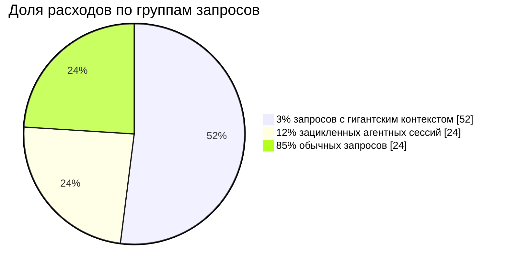

# 00. Бейзлайн: измерить, прежде чем чинить

[← К содержанию](../README.md) · [Дальше: 01. Кэширование промпта →](../01-prompt-caching/README.md)

> **Главный вопрос модуля.** Сколько денег стоит одна успешно решённая задача сегодня — и какой процент задач вы решаете правильно?

Пока на эти два вопроса нет ответа в цифрах, любая «оптимизация» — это изменение системы наугад. Половина команд, которые приходят с запросом «сделайте дешевле», после установки замеров обнаруживают, что 80% счёта делают 3% запросов, и оптимизировать нужно было ровно эти 3%, а не всё подряд.

**Критерий приёмки модуля:** `make baseline` печатает таблицу, где на каждую конфигурацию есть `pass_rate`, `cost_per_task`, `cost_per_success`, `p50/p95 latency` и разбивка токенов по типам.

---

## Содержание

- [00.1 Провал без этого модуля](#001-провал-без-этого-модуля)
- [00.2 Три вещи, которые надо построить в правильном порядке](#002-три-вещи-которые-надо-построить-в-правильном-порядке)
- [00.3 Блок usage: единственный источник правды](#003-блок-usage-единственный-источник-правды)
- [00.4 Формула стоимости в коде](#004-формула-стоимости-в-коде)
- [00.5 Набор тестов: минимальный жизнеспособный eval](#005-набор-тестов-минимальный-жизнеспособный-eval)
- [00.6 Таблица бейзлайна](#006-таблица-бейзлайна)
- [00.7 Правило Парето расходов](#007-правило-парето-расходов)
- [00.8 Как это ломается](#008-как-это-ломается)
- [Упражнения](#упражнения)
- [Чек-лист приёмки](#чек-лист-приёмки)
- [Антиметрика модуля](#антиметрика-модуля)

---

## 00.1 Провал без этого модуля

**Сценарий 1. Экономия, которой не было.** Команда включила дешёвую модель и отчиталась о −70% расходов. Через месяц счёт вернулся: пользователи стали переспрашивать, число запросов на диалог выросло вдвое, часть тикетов ушла на живых операторов. Метрика `cost_per_request` упала, `cost_per_success` выросла. Без бейзлайна на успехах это невозможно было заметить.

**Сценарий 2. Оптимизировали не то.** Две недели ушли на сжатие системного промпта с 4 000 до 2 500 токенов. Реальные деньги делал не промпт, а 12 запросов в сутки, где в контекст попадали PDF по 300 страниц. Профиль расходов показал бы это за пять минут.

**Сценарий 3. Регресс без свидетелей.** После «оптимизации» точность извлечения полей упала с 94% до 79%. Тестов не было, узнали через шесть недель от клиента, который нашёл ошибки в отчётности.

---

## 00.2 Три вещи, которые надо построить в правильном порядке


Порядок важен. Учёт без тестов даёт возможность сделать дешевле и хуже. Тесты без учёта — сделать лучше и дороже, не заметив этого. Нужны оба.

| Артефакт | Минимальная версия, которой достаточно | Сколько стоит сделать |
|---|---|---|
| Учёт расходов | одна функция `price(usage, model)` и строка в лог на каждый вызов | 1–2 часа |
| Набор тестов | 20 реальных задач с эталонными ответами в JSONL | полдня, самая полезная работа недели |
| Бейзлайн | таблица из трёх строк: текущая конфигурация, конфигурация «дорогая эталонная», конфигурация «дешёвая наивная» | час |

**Где взять 20 задач.** Не придумывайте — возьмите из логов. Двадцать реальных запросов пользователей: десять типичных, пять сложных, пять тех, на которых система уже ошибалась. Последние пять важнее остальных пятнадцати.

---

## 00.3 Блок usage: единственный источник правды

Любой ответ API возвращает блок использования токенов. Считать деньги нужно по нему, а не по своим оценкам длины строк: токенизация не совпадает с символами, а системные накладные расходы вы всё равно не угадаете.

Что смотреть в `usage` и что это значит:

| Поле | Смысл | Признак проблемы |
|---|---|---|
| `input_tokens` | входные токены, посчитанные по полной цене | не падает при повторных запросах с той же шапкой — кэш не работает |
| `cache_creation_input_tokens` | токены, записанные в кэш (с надбавкой) | растёт на каждом запросе — вы пишете кэш и не читаете его: границы кэша прыгают |
| `cache_read_input_tokens` | токены, прочитанные из кэша (со скидкой) | ноль в многошаговом сценарии — главная утечка денег |
| `output_tokens` | сгенерированные токены, включая размышления | сравнимы с входом — модель пишет слишком много |
| количество шагов цикла | считаете сами в своём агенте | больше 10–12 на простую задачу — цикл не умеет останавливаться |

**Правило логирования.** Один вызов API — одна строка структурированного лога. Обязательные поля: `ts`, `task_id`, `step`, `model`, `input_tokens`, `cache_read`, `cache_write`, `output_tokens`, `cost_usd`, `latency_ms`, `stop_reason`, `ok`. Без `task_id` вы не сможете сложить стоимость задачи из стоимости шагов — а это единственная цифра, которая имеет смысл.

---

## 00.4 Формула стоимости в коде

Полная реализация — в [code/cost_meter.py](../code/cost_meter.py), здесь суть.

```python
# Цены — иллюстративные, за миллион токенов. Держите их в конфиге,
# а не в коде, и обновляйте по официальному прайс-листу.
PRICES = {
    "premium":  {"in": 15.00, "out": 75.00},   # верхний уровень интеллекта
    "balanced": {"in":  3.00, "out": 15.00},   # рабочая лошадка
    "cheap":    {"in":  0.80, "out":  4.00},   # быстрая дешёвая модель
}
CACHE_WRITE_MULT = 1.25   # надбавка за запись в кэш (короткий TTL)
CACHE_READ_MULT  = 0.10   # скидка при чтении из кэша
BATCH_MULT       = 0.50   # асинхронная очередь

def price(usage: dict, tier: str, batch: bool = False) -> float:
    p = PRICES[tier]
    m = BATCH_MULT if batch else 1.0
    cost = (
        usage.get("input_tokens", 0)                * p["in"]
        + usage.get("cache_creation_input_tokens", 0) * p["in"] * CACHE_WRITE_MULT
        + usage.get("cache_read_input_tokens", 0)     * p["in"] * CACHE_READ_MULT
        + usage.get("output_tokens", 0)               * p["out"]
    )
    return cost * m / 1_000_000
```

Три правила, которые экономят потом недели споров:

1. **Цены — в конфиге, не в коде.** Они меняются, и вы не хотите искать их по всему проекту.
2. **Считайте деньги в момент вызова, а не постфактум.** Пересчёт по логам через месяц всегда упирается в то, что тарифы уже другие.
3. **Складывайте стоимость по `task_id`, включая провальные попытки.** Задача, решённая с третьей попытки, стоила три вызова.

---

## 00.5 Набор тестов: минимальный жизнеспособный eval

Eval не обязан быть научным. Он обязан быть **воспроизводимым** и **чувствительным**: если качество упало, тест должен покраснеть.

```python
# eval.jsonl — по одной задаче на строку
# {"id": "t01", "input": "...", "expect": {"type": "contains", "value": "инвойс"}}
# {"id": "t02", "input": "...", "expect": {"type": "json_field", "field": "total", "value": 149.9}}
# {"id": "t03", "input": "...", "expect": {"type": "judge", "rubric": "не выдумывает номер заказа"}}

CHECKS = {
    "contains":   lambda out, e: e["value"].lower() in out.lower(),
    "json_field": lambda out, e: json.loads(out).get(e["field"]) == e["value"],
    "regex":      lambda out, e: re.search(e["value"], out) is not None,
    "no_tool":    lambda out, e: e["value"] not in out,        # инструмент не должен вызываться
}
# "judge" — проверка моделью; используйте только там, где формальная проверка невозможна,
# и всегда на дешёвой модели: судья не должен стоить дороже подсудимого.
```

**Три уровня проверок, в порядке предпочтения.**

| Уровень | Пример | Когда применять |
|---|---|---|
| Формальная | JSON-схема, точное совпадение поля, отсутствие запрещённой строки | всегда, когда возможно; быстро, бесплатно, детерминированно |
| Программная | вычислили сумму сами и сравнили; проверили, что вызван нужный инструмент | для агентов: проверяем траекторию, а не только текст |
| Судья-модель | «ответ вежлив и не содержит выдуманных фактов» | последнее средство; дешёвая модель, короткая рубрика, фиксированный промпт |

**Правило.** Тест, который никогда не падал, — не тест. Специально сломайте систему (уберите инструмент, подсуньте пустой контекст) и убедитесь, что тесты покраснели. Иначе вы измеряете не качество, а собственный оптимизм.

---

## 00.6 Таблица бейзлайна

Финальный артефакт модуля. Три конфигурации, один и тот же набор задач.

| Конфигурация | pass_rate | cost_per_task | cost_per_success | p50 latency | out/in |
|---|---|---|---|---|---|
| A. Верхняя модель, без оптимизаций | 0,94 | 0,0410 $ | 0,0436 $ | 7,2 с | 0,08 |
| B. Текущий прод | 0,91 | 0,0290 $ | 0,0319 $ | 5,9 с | 0,11 |
| C. Наивная экономия: дешёвая модель, всё остальное как было | 0,68 | 0,0062 $ | 0,0091 $ | 2,4 с | 0,14 |

Как читать эту таблицу — и это главный урок модуля:

- Конфигурация **A** задаёт **потолок качества**. Всё, что вы делаете дальше, сравнивается с ней. Если ни одна оптимизация не может подобраться к её `pass_rate`, значит вы упёрлись в модель, а не в инженерию.
- Конфигурация **C** выглядит соблазнительно: в семь раз дешевле. Но 32% провалов означают ретраи, эскалации и ручную работу. Добавьте в `cost_per_success` стоимость эскалации — и разрыв сокращается в разы, а иногда меняет знак.
- Цель гайда — получить строку **D**, где `pass_rate` близок к A, а `cost_per_task` близок к C. Достигается рычагами 1–5, а не выбором модели.

**Обязательное поле рядом с таблицей:** дата замера и версия набора тестов. Через два месяца вы не вспомните, чем отличался тот прогон, и сравнение станет бессмысленным.

---

## 00.7 Правило Парето расходов

Прежде чем что-то менять, постройте распределение стоимости задач. Почти всегда картина одна:



Проценты у вас будут свои, но форма кривой — та же. Практический вывод: **сначала обрежьте хвост, потом занимайтесь средним запросом.** Обрезание хвоста обычно даёт больше денег за меньшие усилия и вообще не влияет на качество массовых сценариев.

Как обрезать хвост, ничего не ломая:

1. Поставьте жёсткий лимит на размер входа (в токенах, не в байтах) и явно обрабатывайте его превышение: разбивка на части, отказ с понятным сообщением, отправка в батч.
2. Поставьте лимит шагов агентного цикла и лимит денег на задачу. Достигнут — задача завершается с `stop_reason: budget` и уходит в очередь на разбор, а не молча жжёт бюджет.
3. Заведите алерт на `p99 cost_per_task`. Средняя стоимость может быть идеальной, пока один сценарий раз в час стоит как тысяча обычных.

---

## 00.8 Как это ломается

| Симптом | Настоящая причина | Лечение |
|---|---|---|
| «Мы сэкономили 60%», но счёт за месяц не изменился | считали цену запроса, а не задачи; число запросов выросло | перейти на `cost_per_task` по `task_id` |
| Расчётная стоимость расходится с биллингом на десятки процентов | не учли кэш-запись, размышления или вложения (изображения, файлы) | считать строго по `usage`, сверять с биллингом раз в неделю |
| Тесты зелёные, пользователи жалуются | набор задач составлен из простых случаев | добавить в набор те запросы, на которых уже были жалобы |
| Стоимость задачи скачет в 5 раз между прогонами | нет лимита шагов, агент иногда зацикливается | лимит шагов и денег, [модуль 03](../03-agent-loop/README.md) |
| Судья-модель стоит дороже основного вызова | судья на верхней модели с длинной рубрикой | судья на дешёвой модели, короткая рубрика, только там, где нет формальной проверки |

---

## Упражнения

<details>
<summary><b>1.</b> У вас 40 000 входных токенов и 800 выходных на «balanced» тарифе. Что дешевле сократить: вход вдвое или выход вдвое?</summary>

Считаем по иллюстративным ценам (3 $ за миллион входных, 15 $ за миллион выходных).

Исходно: 40 000 × 3 / 10⁶ = 0,12 $ плюс 800 × 15 / 10⁶ = 0,012 $. Итого 0,132 $.

Сокращение входа вдвое экономит 0,06 $. Сокращение выхода вдвое — 0,006 $. **Здесь выгоднее вход**, в десять раз.

Но это следствие конкретной пропорции: 40 000 к 800 — это отношение 50:1, а цена отличается в 5 раз. Точка, где рычаги равны, — отношение вход/выход равно 5. Поэтому правильный ответ на такой вопрос всегда: **посмотрите на своё отношение out/in.** Если оно выше 0,2 — воюйте с выходом, если ниже 0,05 — с входом. Вот зачем эта колонка в таблице бейзлайна.
</details>

<details>
<summary><b>2.</b> Дешёвая конфигурация: 0,006 $ за попытку, 68% успеха. Дорогая: 0,041 $, 94% успеха. Провал стоит 4 $ ручной работы. Что выбрать?</summary>

Дешёвая: 0,006 + 0,32 × 4 = **1,286 $** за задачу.
Дорогая: 0,041 + 0,06 × 4 = **0,281 $** за задачу.

Дорогая конфигурация в 4,5 раза дешевле. Пока ручная доработка стоит дороже примерно 0,13 $, экономия на модели убыточна. Именно поэтому выбор модели — последний рычаг, и именно поэтому в `cost_per_success` обязательно входит цена провала.
</details>

<details>
<summary><b>3.</b> Как за десять минут понять, работает ли кэш, не читая документацию?</summary>

Отправьте один и тот же запрос дважды подряд и сравните `usage`. Признак работающего кэша: во втором ответе `input_tokens` резко упали, а `cache_read_input_tokens` примерно равны размеру шапки. Если во втором ответе снова `cache_creation_input_tokens` — кэш пишется заново, значит содержимое до границы кэша изменилось между запросами: обычно виноват таймстемп, случайный порядок ключей в JSON или переменная часть, оказавшаяся выше границы. Готовый скрипт: [code/cache_probe.py](../code/cache_probe.py).
</details>

<details>
<summary><b>4.</b> Почему нельзя считать стоимость по длине строки в символах?</summary>

Потому что цена считается в токенах, а соотношение символов и токенов зависит от языка и содержимого: русский текст даёт заметно больше токенов на символ, чем английский, JSON и код токенизируются иначе, изображения и файлы имеют собственную стоимость, не выражаемую в символах. Оценка «по символам» систематически врёт, причём для русскоязычных продуктов — в сторону занижения. Считайте по `usage` из ответа API.
</details>

<details>
<summary><b>5.</b> Набор тестов из 20 задач показывает 100% успеха на всех трёх конфигурациях. Что это значит?</summary>

Что набор бесполезен: он не различает конфигурации, а значит не защитит вас от регресса. Добавьте сложные случаи: длинные документы, противоречивые инструкции, запросы, где нужен отказ, запросы с опечатками, крайние значения. Хороший набор должен показывать разброс: верхняя модель заметно лучше дешёвой. Если разброса нет — либо задачи слишком простые, либо вам действительно достаточно дешёвой модели, и это отличная новость, которую надо проверить на более сложных задачах.
</details>

---

## Чек-лист приёмки

- [ ] Каждый вызов API пишет структурированную строку лога с `usage` и `cost_usd`
- [ ] В логе есть `task_id`, позволяющий сложить стоимость задачи из шагов
- [ ] Цены вынесены в конфиг с датой актуальности
- [ ] Есть `eval.jsonl` минимум на 20 задач, включая пять исторически провальных
- [ ] Проверки формальные там, где это возможно; судья-модель только там, где нельзя иначе
- [ ] Тесты проверены на чувствительность: искусственная поломка их роняет
- [ ] Посчитаны `pass_rate`, `cost_per_task`, `cost_per_success` для трёх конфигураций
- [ ] Построено распределение стоимости задач, найден хвост p95/p99
- [ ] Расчётная стоимость сверена с биллингом, расхождение меньше 10%
- [ ] Таблица бейзлайна сохранена в репозиторий с датой и версией набора тестов

---

## Антиметрика модуля

**Количество метрик на дашборде.** Двадцать графиков расходов, из которых никто не смотрит ни один, хуже трёх честных чисел. Если после этого модуля вы не можете за десять секунд ответить «сколько стоит одна успешная задача» — модуль не сдан, сколько бы графиков ни было нарисовано.

Вторая антиметрика: **процент экономии без указания базы и без `pass_rate` рядом.** Такая цифра в отчёте означает, что кто-то что-то поменял и надеется, что стало лучше.

---

[← К содержанию](../README.md) · [Дальше: 01. Кэширование промпта →](../01-prompt-caching/README.md)
