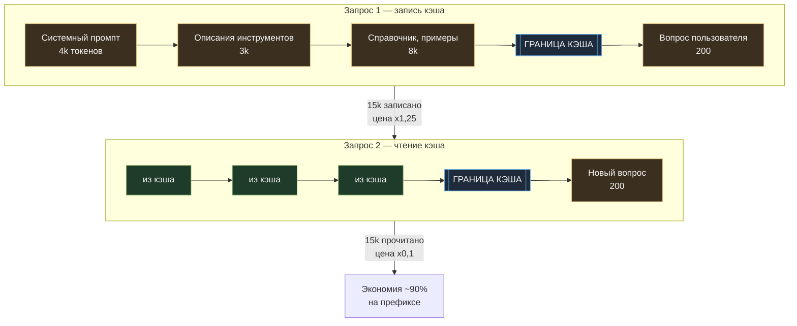
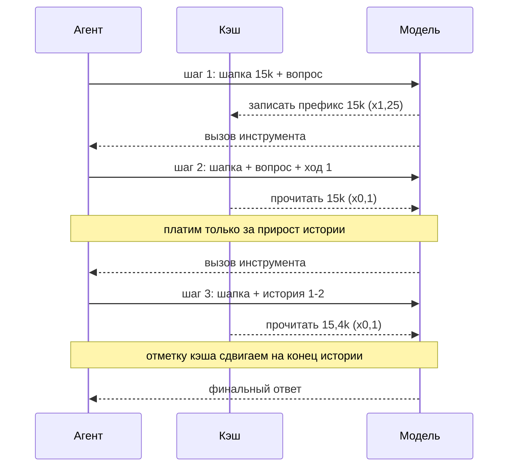

# 01. Кэширование промпта: перестать платить дважды

[← 00. Бейзлайн](../00-baseline/README.md) · [К содержанию](../README.md) · [Дальше: 02. Входные токены →](../02-input-tokens/README.md)

> **Главный вопрос модуля.** Какая часть вашего промпта не меняется между запросами — и почему вы платите за неё каждый раз?

Это рычаг номер один: самый большой эффект при нулевом риске для качества. Ответ модели после включения кэша **байт в байт тот же** — меняется только цена. Если в вашем продукте многошаговый агент или длинная системная инструкция, а `cache_read_input_tokens` в логах равны нулю, вы переплачиваете в разы прямо сейчас.

**Критерий приёмки:** `make cache-probe` показывает `cache_read_input_tokens` ≥ 90% размера стабильной шапки на втором и последующих запросах, а `cache_creation_input_tokens` равны нулю на них же.

---

## Содержание

- [01.1 Как это работает в одну картинку](#011-как-это-работает-в-одну-картинку)
- [01.2 Экономика кэша: когда он окупается](#012-экономика-кэша-когда-он-окупается)
- [01.3 Главное правило: стабильное сверху, изменчивое снизу](#013-главное-правило-стабильное-сверху-изменчивое-снизу)
- [01.4 Куда ставить границы кэша](#014-куда-ставить-границы-кэша)
- [01.5 Время жизни кэша и как его продлевать](#015-время-жизни-кэша-и-как-его-продлевать)
- [01.6 Кэш в многошаговом диалоге](#016-кэш-в-многошаговом-диалоге)
- [01.7 Восемь убийц кэша](#017-восемь-убийц-кэша)
- [01.8 Проверка: зонд кэша](#018-проверка-зонд-кэша)
- [Упражнения](#упражнения)
- [Чек-лист приёмки](#чек-лист-приёмки)
- [Антиметрика модуля](#антиметрика-модуля)

---

## 01.1 Как это работает в одну картинку

Промпт обрабатывается последовательно, от начала к концу. Кэш запоминает результат обработки **префикса** — всего, что идёт до отметки границы. При следующем запросе, если префикс совпал побайтово, модель не пересчитывает его, а берёт готовое состояние.



Из механики «кэшируется префикс» вытекает всё остальное в этом модуле. **Любое изменение хотя бы одного символа выше границы обнуляет кэш целиком.** Не частично — целиком.

---

## 01.2 Экономика кэша: когда он окупается

Пусть шапка равна `S` токенов, а запросов к ней `N`. Без кэша платим `S × N`. С кэшем: `S × 1,25` за первую запись плюс `S × 0,1 × (N − 1)` за чтения.

| Число запросов к одной шапке | Без кэша | С кэшем | Экономия |
|---|---|---|---|
| 1 | 1,00 S | 1,25 S | −25% (кэш вреден) |
| 2 | 2,00 S | 1,35 S | 33% |
| 3 | 3,00 S | 1,45 S | 52% |
| 5 | 5,00 S | 1,65 S | 67% |
| 10 | 10,00 S | 2,15 S | 79% |
| 50 | 50,00 S | 6,15 S | 88% |
| ∞ | — | — | стремится к 90% |

**Точка окупаемости — второй запрос.** Это ключевое число: почти в любом продукте одна и та же шапка используется хотя бы дважды, а в агенте — 5–20 раз за одну задачу. Отсюда практическое правило:

> Если шапка достаточно длинная и используется больше одного раза за время жизни кэша — кэшируйте. Не кэшировать стоит только одиночные запросы с уникальным префиксом.

**Второй эффект, о котором забывают: задержка.** Чтение из кэша не только дешевле, но и быстрее — первый токен приходит заметно раньше, потому что модели не нужно заново обрабатывать десятки тысяч токенов префикса. В интерактивных продуктах это иногда важнее денег.

---

## 01.3 Главное правило: стабильное сверху, изменчивое снизу

Всё сводится к одной инженерной операции: **разложить промпт по убыванию стабильности.**

| Слой | Стабильность | Где должен быть |
|---|---|---|
| Роль, политика, стиль, правила безопасности | месяцы | самый верх |
| Описания инструментов (JSON Schema) | недели | сразу под ними |
| Справочники, стайлгайд, длинные few-shot примеры | недели | далее |
| Профиль организации, настройки тарифа клиента | часы–дни | далее, если запросов от того же клиента много |
| Документы текущей сессии | минуты | ниже границы или во второй границе |
| История диалога | каждый шаг | ниже |
| Текущий вопрос, таймстемп, случайные идентификаторы | каждый запрос | самый низ, всегда |

Типичная ошибка в реальном коде — строка вида «Сегодня 17 августа 2026, 14:32:07» в начале системного промпта. Она обнуляет кэш **на каждом запросе**: вы платите надбавку за запись 1,25 и никогда не читаете. То есть включение кэша в таком виде делает систему на 25% дороже, чем без него.

**Что делать с датой, если она нужна модели.** Три варианта, все рабочие:
1. Округлять до суток: «Сегодня 2026-08-17» меняется раз в день — кэш живёт весь день.
2. Переносить точное время вниз, в блок с вопросом пользователя.
3. Отдавать время инструментом `get_current_time`, который модель вызывает, когда время действительно нужно (обычно — почти никогда).

---

## 01.4 Куда ставить границы кэша

Границ обычно несколько, и это нормально. Разумная схема на три отметки:

```python
system = [
    {   # блок 1: политика и роль — меняется раз в месяц
        "type": "text",
        "text": POLICY_AND_ROLE,
        "cache_control": {"type": "ephemeral"},
    },
    {   # блок 2: справочник и примеры — меняется при релизе
        "type": "text",
        "text": KNOWLEDGE_PACK + FEW_SHOTS,
        "cache_control": {"type": "ephemeral"},
    },
]

tools = TOOLS  # схемы инструментов: держите порядок и формулировки стабильными

messages = [
    # ... история диалога; отметку кэша ставим на последний стабильный ход
    {"role": "user", "content": [
        {"type": "text", "text": user_question},   # никаких отметок: это меняется всегда
    ]},
]
```

Правила расстановки:

1. **Не больше нескольких отметок.** Каждая отметка — это отдельный сегмент, который может инвалидироваться; больше сегментов — больше шансов ошибиться. Три–четыре достаточно для любой реальной системы.
2. **Отметка ставится на конец стабильного блока, а не на начало.** Кэшируется всё, что выше отметки.
3. **Между отметками не должно быть изменчивого контента.** Одна динамическая строка посередине обнуляет всё, что ниже неё.
4. **Слишком короткие блоки кэшировать бессмысленно** — у кэша есть минимальный порог длины, ниже которого отметка просто игнорируется. Проверяйте по документации своей модели; порядок величины — сотни–тысячи токенов.
5. **Проверяйте эффект замером, а не рассуждением.** Единственное доказательство — `cache_read_input_tokens` в `usage`.

---

## 01.5 Время жизни кэша и как его продлевать

Кэш живёт ограниченное время с последнего обращения. Обычно доступны два режима: короткий (порядка минут) и длинный (порядка часа) — второй дороже на записи, но живёт дольше.

| Профиль нагрузки | Что выбрать | Почему |
|---|---|---|
| Плотный поток запросов, активный диалог | короткий TTL | каждое обращение продлевает жизнь кэша, длинный не нужен |
| Разговор с паузами по 10–20 минут | длинный TTL | иначе к возвращению пользователя кэш истёк и вы платите запись заново |
| Пакетная обработка одним пулом | короткий TTL | запросы идут подряд, кэш всё время горячий |
| Редкие запросы раз в час | не кэшировать или длинный TTL по расчёту | посчитайте: надбавка за запись против экономии на чтениях |
| Ночной прогон по расписанию | короткий TTL внутри прогона | между прогонами кэш всё равно не выживет |

**Приём «подогрев кэша».** Если знаете, что через несколько секунд придёт поток запросов с одной шапкой (например, пользователь открыл рабочее пространство), отправьте один минимальный запрос заранее: он запишет кэш, и все последующие пойдут по цене чтения. Стоит копейки, экономит заметно. Не превращайте это в фоновый цикл, который греет кэш круглосуточно, — это отдельный антипаттерн, см. [09](../09-anti-patterns/README.md).

**Приём «общая шапка для всех клиентов».** Если у вас мультиарендная система, вынесите всё общее в верхний блок, а специфику клиента — в отдельный сегмент ниже. Тогда общий префикс кэшируется один раз и обслуживает всех, а не по разу на каждого клиента.

---

## 01.6 Кэш в многошаговом диалоге

В агентном цикле история растёт: каждый шаг добавляет ответ модели и результат инструмента. Наивная реализация переотправляет всю историю без отметок и платит полную цену за каждый шаг.



**Приём «скользящая отметка».** На каждом шаге ставьте отметку кэша на последний завершённый ход истории. Тогда каждый следующий шаг читает из кэша всё, что было раньше, и платит полную цену только за прирост — обычно за один результат инструмента.

```python
def build_messages(history, question):
    msgs = []
    for i, turn in enumerate(history):
        content = turn["content"]
        # отметка только на последнем завершённом ходе
        if i == len(history) - 1 and isinstance(content, list) and content:
            content = [*content[:-1], {**content[-1], "cache_control": {"type": "ephemeral"}}]
        msgs.append({"role": turn["role"], "content": content})
    msgs.append({"role": "user", "content": question})
    return msgs
```

Экономика на 8 шагов при шапке 15k и приросте истории по 500 токенов за шаг: вместо примерно 150 000 полных входных токенов получаем эквивалент около 30 000. **Пятикратная экономия на входе при полностью идентичном поведении агента.**

Важное взаимодействие с [модулем 03](../03-agent-loop/README.md): компакция истории (сжатие старых ходов) **обнуляет кэш**, потому что переписывает префикс. Поэтому компактить надо не каждый шаг, а по порогу, и сразу большим куском — тогда одна запись кэша обслужит много последующих шагов.

---

## 01.7 Восемь убийц кэша

Список составлен по частоте встречаемости в реальных проектах. Первые три — причина 80% случаев «кэш включили, а он не работает».

| № | Убийца | Как выглядит | Как починить |
|---|---|---|---|
| 1 | Таймстемп или `uuid` в системном промпте | `cache_creation` на каждом запросе, `cache_read` = 0 | округлить до суток или унести вниз |
| 2 | Нестабильный порядок ключей при сериализации JSON | кэш попадает через раз | `json.dumps(..., sort_keys True)` везде, где промпт собирается из словарей |
| 3 | Динамический набор инструментов | кэш ломается при смене сценария | фиксированный полный набор инструментов, фильтрация — на уровне логики, не схемы |
| 4 | Персонализация в верхнем блоке (имя пользователя, его настройки) | у каждого пользователя свой кэш, экономии почти нет | общий префикс сверху, персональное — отдельным сегментом ниже |
| 5 | Смена модели или версии модели | кэш не переносится между моделями | каскад моделей строить так, чтобы дешёвая ветка имела свой кэш |
| 6 | Незначимые правки в промпте на каждом деплое | кэш холодный после каждого релиза | не страшно, но не редактируйте промпт «для красоты» в горячие часы |
| 7 | Пробелы, переводы строк, форматирование, собранные шаблонизатором по-разному | кэш то попадает, то нет | нормализовать сборку промпта одной функцией, покрыть тестом на побайтовое равенство |
| 8 | Слишком короткий кэшируемый блок | отметка есть, эффекта нет | объединить блоки, чтобы префикс превысил минимальный порог |

**Диагностический тест на убийцу.** Соберите промпт дважды подряд из одних и тех же данных и сравните строки побайтово: `assert build_prompt(x)   build_prompt(x)`. Удивительно часто этот тест падает — и это ответ на вопрос, почему нет кэша.

---

## 01.8 Проверка: зонд кэша

Полная версия — [code/cache_probe.py](../code/cache_probe.py). Логика минимальна: три идентичных запроса, печатаем `usage`.

```python
def probe(client, build_request):
    rows = []
    for i in range(3):
        r = client.messages.create(**build_request("вопрос-заглушка"))
        u = r.usage
        rows.append({
            "n": i + 1,
            "input": u.input_tokens,
            "write": getattr(u, "cache_creation_input_tokens", 0),
            "read":  getattr(u, "cache_read_input_tokens", 0),
            "out":   u.output_tokens,
        })
    return rows
```

Как читать результат:

| Что видим | Диагноз |
|---|---|
| запрос 1: write большой, read 0; запросы 2–3: write 0, read большой | **всё правильно**, кэш работает |
| write большой на всех трёх | префикс меняется между запросами — ищите убийцу из списка выше |
| write 0 и read 0 на всех | отметки кэша не проставлены или блок короче минимального порога |
| read меньше половины ожидаемого | отметка стоит слишком высоко, ниже неё много стабильного контента, который можно было закэшировать |
| всё правильно на зонде, но в проде `read` = 0 | в проде между запросами вклинивается что-то динамическое; сравните собранные промпты побайтово |

---

## Упражнения

<details>
<summary><b>1.</b> Шапка 20 000 токенов, 6 обращений за диалог, тариф 3 $ за миллион входных. Сколько экономит кэш на одном диалоге?</summary>

Без кэша: 20 000 × 6 = 120 000 токенов → 0,36 $.

С кэшем: запись 20 000 × 1,25 = 25 000 плюс чтения 20 000 × 0,1 × 5 = 10 000. Итого эквивалент 35 000 токенов → 0,105 $.

Экономия 0,255 $ на диалоге, то есть **71%** на префиксе. При 10 000 диалогов в сутки это 2 550 $ в день — на одной строке `cache_control` и без единого изменения в поведении продукта.
</details>

<details>
<summary><b>2.</b> В системный промпт нужно передать список из 40 доступных пользователю проектов. Он меняется, когда пользователь создаёт проект. Куда его класть?</summary>

Зависит от частоты изменений относительно частоты запросов. Практичное решение — **не класть вообще**: отдать инструментом `list_projects()`. Тогда префикс остаётся идеально стабильным для всех пользователей, а список подтягивается только в тех запросах, где он действительно нужен (обычно это меньшинство). Это одновременно рычаг 1 и рычаг 2, см. [модуль 02](../02-input-tokens/README.md).

Если список нужен почти всегда, положите его **во второй сегмент**, ниже общей политики: тогда создание проекта у одного пользователя не обнулит общий префикс, разделяемый всеми.
</details>

<details>
<summary><b>3.</b> После включения кэша счёт вырос на 20%. Что произошло?</summary>

Вы платите надбавку за запись и никогда не читаете. Причины по частоте: динамический контент выше границы (таймстемп, идентификатор запроса), уникальный префикс на каждый запрос (персонализация в верхнем блоке), либо запросы приходят реже, чем живёт кэш. Проверка — зонд из 01.8. Если `cache_creation` не ноль на втором запросе, вы нашли проблему.
</details>

<details>
<summary><b>4.</b> Почему компакция истории конфликтует с кэшем и как их поженить?</summary>

Компакция перезаписывает начало истории — то есть меняет префикс, и кэш обнуляется. Поженить так: компактить редко и крупно (по порогу заполнения контекста, а не каждый шаг), помещать результат компакции в стабильный блок **выше** отметки кэша и не трогать его до следующей компакции. Тогда одна запись кэша обслужит десятки последующих шагов. Считайте так: если компакция происходит чаще, чем раз в 3–4 шага, вы теряете на записях больше, чем экономите на сжатии.
</details>

<details>
<summary><b>5.</b> У вас 5 000 клиентов, у каждого свой набор правил на 3 000 токенов. Общая политика — 10 000 токенов. Как организовать кэш?</summary>

Два сегмента. Первый — общая политика и инструменты (10 000 токенов, разделяется всеми). Второй — правила клиента (3 000 токенов, свой кэш на клиента). Так общий префикс греется один раз и обслуживает весь трафик, а клиентский сегмент окупается у активных клиентов и просто не успевает окупиться у тех, кто заходит раз в день, — что не страшно, потому что там надбавка платится с 3 000 токенов, а не с 13 000.

Ошибка, которую здесь делают: склеивать политику и правила клиента в одну строку. Тогда у вас 5 000 отдельных кэшей по 13 000 токенов, и большинство из них не окупается.
</details>

<details>
<summary><b>6.</b> Как убедиться, что кэш не сломается на следующем релизе?</summary>

Тестом. Соберите промпт для фиксированного набора входных данных и сравните с эталонным снимком (`snapshot`) побайтово. Тест падает при любом изменении промпта — это и есть цель: изменение должно быть осознанным, а не случайным следствием правки шаблона. Второй тест: `build_prompt(x)   build_prompt(x)` — ловит нестабильную сериализацию. Оба теста дешёвые, оба ловят самые дорогие ошибки в этом гайде.
</details>

---

## Чек-лист приёмки

- [ ] Промпт разложен по слоям стабильности, изменчивое — внизу
- [ ] Отметки кэша стоят на границах стабильных блоков, их не больше четырёх
- [ ] В верхних блоках нет таймстемпов, `uuid`, имён пользователей и прочей персонализации
- [ ] Сериализация словарей в промпт делается с сортировкой ключей
- [ ] Набор инструментов и их порядок фиксированы между запросами
- [ ] Есть тест на побайтовую стабильность собранного промпта
- [ ] Зонд кэша показывает `write` только на первом запросе
- [ ] В многошаговом цикле применяется скользящая отметка на последнем ходе истории
- [ ] Выбран режим TTL, соответствующий профилю паузы между запросами
- [ ] В дашборде есть `cache_hit_ratio` и алерт на его падение
- [ ] Проверено, что стоимость задачи упала, а `pass_rate` не изменился

---

## Антиметрика модуля

**Количество отметок `cache_control` в коде.** Можно расставить их щедро, обнулить кэш на каждом запросе и получить счёт на 25% выше исходного. Кэш измеряется не отметками, а полем `cache_read_input_tokens`.

Вторая антиметрика: **`cache_hit_ratio` без учёта размера.** Попадание в кэш на блоке из 200 токенов не стоит ничего. Смотрите на долю **сэкономленных денег**, а не на долю попаданий.

---

[← 00. Бейзлайн](../00-baseline/README.md) · [К содержанию](../README.md) · [Дальше: 02. Входные токены →](../02-input-tokens/README.md)
