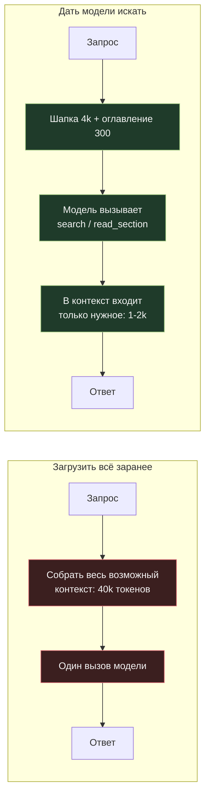

# 02. Управление входными токенами: пусть модель сама находит контекст

[← 01. Кэширование](../01-prompt-caching/README.md) · [К содержанию](../README.md) · [Дальше: 03. Агентный цикл →](../03-agent-loop/README.md)

> **Главный вопрос модуля.** Какая доля того, что вы кладёте в контекст, реально используется в ответе?

Честный ответ в большинстве систем — от 2 до 10 процентов. Остальное положили «на всякий случай»: полный справочник, потому что вдруг понадобится правило №37; весь документ, потому что лень нарезать; всю историю, потому что так проще. За «всякий случай» вы платите на каждом запросе.

**Критерий приёмки:** `make context-audit` печатает, сколько токенов вошло, сколько из них модель фактически использовала (по цитированию и по вызовам инструментов), и список блоков, которые не использовались ни в одной из задач набора.

---

## Содержание

- [02.1 Провал без этого модуля](#021-провал-без-этого-модуля)
- [02.2 Два подхода: загрузить всё против дать искать](#022-два-подхода-загрузить-всё-против-дать-искать)
- [02.3 Экономика поиска вместо загрузки](#023-экономика-поиска-вместо-загрузки)
- [02.4 Приём «ссылка вместо тела»](#024-приём-ссылка-вместо-тела)
- [02.5 Аудит контекста: что выкинуть прямо сегодня](#025-аудит-контекста-что-выкинуть-прямо-сегодня)
- [02.6 Дешёвая предобработка перед моделью](#026-дешёвая-предобработка-перед-моделью)
- [02.7 Описания инструментов: скрытый расход](#027-описания-инструментов-скрытый-расход)
- [02.8 Как это ломается](#028-как-это-ломается)
- [Упражнения](#упражнения)
- [Чек-лист приёмки](#чек-лист-приёмки)
- [Антиметрика модуля](#антиметрика-модуля)

---

## 02.1 Провал без этого модуля

**Сценарий 1. Справочник целиком.** В системный промпт положили 60 страниц регламента (примерно 40 000 токенов), чтобы «модель знала все правила». Каждый запрос стоит как небольшой роман. Замер показал: в 92% ответов используются одни и те же четыре правила.

**Сценарий 2. Весь документ вместо нужной страницы.** Пользователь спрашивает про пункт договора. В контекст летит весь PDF на 180 страниц. Модель находит ответ на странице 12. Остальные 168 страниц вы оплатили.

**Сценарий 3. Гигантские результаты инструментов.** Инструмент `search_orders` возвращает полный JSON со всеми вложенными объектами: 30 000 токенов на один вызов, из которых модели нужны три поля. И это повторяется на каждом шаге цикла.

Общий знаменатель всех трёх: **контекст собирается разработчиком заранее, а не моделью по потребности.**

---

## 02.2 Два подхода: загрузить всё против дать искать



| Критерий | Загрузить всё | Дать искать |
|---|---|---|
| Входные токены | огромные и постоянные | маленькие и пропорциональные задаче |
| Число вызовов модели | один | два–четыре |
| Задержка | ниже | выше на один–два круга |
| Качество на простых вопросах | одинаково | одинаково |
| Качество на «иголке в стоге сена» | падает: модель теряет нужное среди шума | выше: в контексте только релевантное |
| Стоимость | линейно растёт с размером базы | почти не зависит от размера базы |

**Когда «загрузить всё» правильно.** Если весь ваш контекст меньше нескольких тысяч токенов и он стабилен — не усложняйте, положите его в кэшируемую шапку и забудьте. Поиск нужен там, где база большая или изменчивая.

**Практическое правило перехода.** Если стабильный контекст больше примерно 8–10 тысяч токенов, а используется из него меньше пятой части — переводите на поиск. До этого порога выигрыш не окупает усложнения.

---

## 02.3 Экономика поиска вместо загрузки

Считаем на цифрах сценария 1: регламент 40 000 токенов, тариф 3 $ за миллион входных, 100 000 запросов в месяц.

**Вариант A. Всё в шапке без кэша.** 40 000 × 3 / 10⁶ = 0,12 $ на запрос → **12 000 $ в месяц.**

**Вариант B. Всё в шапке с кэшем.** Кэш горячий, чтение 0,1: примерно 0,012 $ на запрос → **1 200 $.** Уже в десять раз лучше и это делается за час, см. [модуль 01](../01-prompt-caching/README.md).

**Вариант C. Поиск по регламенту.** Шапка 4 000 (кэшируется) + оглавление 300 + в среднем 1 200 токенов найденных фрагментов + второй вызов модели. Порядка 0,004–0,006 $ на запрос с учётом двух вызовов → **400–600 $.**

**Вывод, который важнее цифр.** Рычаги складываются: сначала кэш (в 10 раз), потом поиск (ещё в 2–3 раза). Обратный порядок — сначала месяц строить поиск, потом добавить кэш — даёт тот же результат, но экономия начинается на месяц позже.

**Скрытый бонус варианта C.** Стоимость перестаёт зависеть от размера базы знаний. Регламент вырос вдвое — счёт не изменился. Это единственный способ сделать расходы предсказуемыми при растущем корпусе документов.

---

## 02.4 Приём «ссылка вместо тела»

Самый недооценённый приём в этом гайде. Идея: инструменты возвращают модели не данные, а **идентификаторы и сводку**, а полное тело подтягивается отдельным вызовом только если модель его действительно запросила.

```python
# Плохо: 30 000 токенов на каждый вызов
def search_orders(query):
    return db.query(query)                    # полные объекты со всеми полями

# Хорошо: 400 токенов, полное тело — по требованию
def search_orders(query, limit=10):
    rows = db.query(query, limit=limit)
    return [
        {"id": r.id, "date": r.date, "total": r.total, "status": r.status}
        for r in rows
    ]                                          # только поля, по которым принимают решение

def get_order(order_id, fields=None):
    r = db.get(order_id)
    return r.subset(fields) if fields else r.summary()
```

Правила проектирования «экономных» инструментов:

1. **Поиск возвращает список сводок, а не тел.** Пять–десять записей по 3–6 полей.
2. **Есть отдельный инструмент «дай подробности по id».** Модель вызовет его один раз для одной записи вместо получения ста записей целиком.
3. **Обязательный `limit` с разумным значением по умолчанию** и явное «показано 10 из 3 482» в ответе, чтобы модель понимала, что список усечён, и могла уточнить запрос.
4. **Ответ инструмента усекается на стороне кода, а не надеждой на модель.** Жёсткий лимит в токенах на результат любого инструмента: превысил — обрезаем и добавляем пометку об усечении.
5. **Никогда не возвращайте служебные поля**: внутренние идентификаторы связей, метки времени изменения, флаги миграций. Модель их не использует, а токены стоят денег на каждом шаге цикла.

Замер, который стоит сделать сегодня: посчитайте средний размер ответа каждого инструмента в токенах и отсортируйте по убыванию. Первые два–три обычно и есть весь ваш перерасход.

---

## 02.5 Аудит контекста: что выкинуть прямо сегодня

Пройдите по списку и примените к своему промпту. Каждый пункт проверяется одним прогоном набора тестов: удалили — тесты зелёные — оставили удалённым.

| Что искать | Типичный размер | Почему это можно убрать |
|---|---|---|
| Вежливые преамбулы «ты профессиональный помощник, который всегда старается» | 100–400 токенов | не меняет поведение; проверяется удалением |
| Повторы одной инструкции в трёх формулировках | 200–800 | оставить одну, самую конкретную |
| Правила для сценариев, которых нет в продукте | 500–5 000 | наследие прототипа |
| Длинные few-shot примеры на задачи, где модель и так не ошибается | 1 000–10 000 | оставить примеры только для сложных краевых случаев |
| Полные схемы БД, XML, JSON целиком | 2 000–40 000 | заменить на компактное описание нужных полей |
| «Формат ответа» на 30 строк | 300–600 | заменить структурированным выводом по схеме, см. [модуль 04](../04-output-tokens/README.md) |
| Инструкции про инструменты, которые уже описаны в схемах | 200–1 000 | дублирование: модель читает и то и то |
| История диалога старше 20 ходов | 2 000–20 000 | компакция или отбрасывание, см. [модуль 03](../03-agent-loop/README.md) |
| Служебные поля в результатах инструментов | 1 000–30 000 на вызов | фильтрация на стороне кода |
| Изображения в полном разрешении там, где нужен текст | эквивалент тысяч токенов | распознать текст дешёвым способом и передать текстом |

**Метод «удали и проверь».** Единственный надёжный способ понять, нужен ли абзац: удалить его и прогнать набор тестов. Делайте по одному изменению за прогон, иначе не поймёте, что сработало. Ведите таблицу: что удалили, сколько токенов сэкономили, что стало с `pass_rate`.

Реальный результат такого аудита на типичном проекте: системный промпт с 6 200 до 2 400 токенов при неизменном качестве. Это 60% входа, которые никто не защищал, потому что никто не проверял.

---

## 02.6 Дешёвая предобработка перед моделью

Правило: **не тратьте токены верхней модели на работу, которую делает `grep`.**

| Задача | Дорогой способ | Дешёвый способ |
|---|---|---|
| Найти в логе строки с ошибкой | отдать модели 200 000 токенов логов | `grep` по шаблону, отдать 40 строк вокруг совпадений |
| Понять, есть ли в документе раздел про оплату | отдать весь документ | построить оглавление один раз, отдать оглавление |
| Извлечь таблицу из PDF | отдать страницу как изображение | извлечь текст парсером, отдать текст |
| Проверить, что JSON валиден | спросить модель | `json.loads` |
| Отсеять явно нерелевантные документы | отдать все 50 моделью | предфильтр по ключевым словам или дешёвым эмбеддингам |
| Классифицировать 100 000 коротких текстов | верхняя модель по одному | дешёвая модель пачками через батч, см. [модуль 05](../05-batch-api/README.md) |

**Каскад предфильтров** — рабочая архитектура для больших корпусов:


Каждая ступень отсекает порядок величины, а стоит на порядок меньше следующей. Ключевое требование к каскаду: **на каждой ступени измеряйте, сколько правильных документов вы теряете.** Ступень, которая отсекает 90% шума и 15% нужного, ухудшает продукт, а не улучшает.

---

## 02.7 Описания инструментов: скрытый расход

Схемы инструментов — часть входного промпта, и они пересылаются на каждом шаге. Двадцать инструментов с подробными описаниями легко дают 6 000–10 000 токенов, о которых никто не помнит, потому что они не видны в коде промпта.

| Приём | Эффект | Риск |
|---|---|---|
| Сократить описания до одного точного предложения плюс примеры значений | −40…−60% на схемах | низкий, если описание осталось однозначным |
| Убрать инструменты, которые не вызывались ни разу за месяц | пропорционально | нулевой; проверьте по логам вызовов |
| Объединить `create_x` / `update_x` / `delete_x` в один `manage_x(action, ...)` | −30% на схемах | средний: модель чаще путает `action`, проверяйте тестами |
| Разбить один агент с 25 инструментами на два по 8 | −50% на схемах у каждого | средний: нужна маршрутизация, см. [модуль 07](../07-architecture/README.md) |
| Держать набор инструментов **фиксированным** ради кэша | косвенно большой | нулевой |

Важный конфликт, который надо решить осознанно: **динамическая подгрузка инструментов экономит токены, но убивает кэш** (см. [01.7](../01-prompt-caching/README.md)). Правильный компромисс — фиксированный набор для каждой роли агента, а не набор, зависящий от текущего запроса. Роль стабильна в течение сессии, значит кэш живёт.

**Как считать.** Сериализуйте `tools` в JSON, посчитайте токены, разделите на число инструментов. Больше 300 токенов на инструмент — почти наверняка описания раздуты. Меньше 80 — возможно, модель не понимает, когда их вызывать, и вы платите за ошибочные вызовы вместо схем.

---

## 02.8 Как это ломается

| Симптом | Причина | Лечение |
|---|---|---|
| После перехода на поиск качество упало | модель не находит нужное: плохие имена инструментов, нет оглавления, слишком узкий `limit` | добавить оглавление в шапку, увеличить `limit`, улучшить описание инструмента поиска |
| Число шагов выросло, экономия съедена | модель ищет наугад по 5–6 раз | дать инструмент «содержание» и один пример успешного поиска в few-shot |
| Модель галлюцинирует про содержимое, которое не запрашивала | в промпте написано «у тебя есть доступ ко всей базе» | переписать: «ты видишь только то, что вернули инструменты; если данных нет — вызови поиск» |
| Результаты инструментов всё равно огромные | лимит усечения не реализован в коде | жёсткое усечение с пометкой, лимит в токенах, а не в записях |
| Экономия на контексте есть, счёт не изменился | сэкономили на кэшируемой части (она и так стоила 10%), а не на «свежей» | оптимизировать в первую очередь то, что **не** кэшируется: результаты инструментов и историю |

Последняя строка — самая частая ошибка после внедрения модуля 01. **Порядок важен: сначала кэш, потом аудит того, что осталось некэшируемым.**

---

## Упражнения

<details>
<summary><b>1.</b> Регламент 40 000 токенов используется в 8% ответов. Кэшировать или переводить на поиск?</summary>

Сначала кэшировать — это час работы и даёт примерно −90% на этой части. Затем измерить, что осталось: 40 000 × 0,1 = эквивалент 4 000 токенов на запрос. Если 4 000 всё ещё дорого при вашем объёме (например, миллион запросов в месяц — это ощутимые деньги), переводить на поиск. При десяти тысячах запросов в месяц — не трогать: экономия не окупит недели работы и риска регресса.

Общее правило приоритизации: **умножайте экономию на запрос на число запросов и сравнивайте с неделей инженерного времени.**
</details>

<details>
<summary><b>2.</b> Инструмент возвращает 30 000 токенов JSON. Как сократить до 500, ничего не потеряв?</summary>

По шагам: выбрать только поля, по которым принимаются решения (обычно 4–6 из 40); ограничить число записей `limit` с явной пометкой об усечении; убрать вложенные объекты, заменив их идентификаторами; добавить второй инструмент `get_details(id)` для тех редких случаев, когда нужны подробности; усечь результат по жёсткому лимиту токенов на стороне кода. Проверка — набор тестов: если `pass_rate` не упал, вы ничего не потеряли, кроме расходов.
</details>

<details>
<summary><b>3.</b> Почему «положить весь документ в контекст» иногда даёт **худшее** качество, чем поиск по нему?</summary>

Из-за разбавления сигнала. Когда в контексте 180 страниц, релевантные два абзаца конкурируют за внимание с сотнями похожих формулировок; модель чаще цитирует не тот пункт и чаще смешивает похожие разделы. Поиск оставляет в контексте только релевантное — сигнал чище. То есть здесь экономия и качество идут в одну сторону, что бывает не так часто.

Дополнительный эффект: чем длиннее контекст, тем дороже каждая ошибка, потому что вы платите за неё полную цену входа.
</details>

<details>
<summary><b>4.</b> Как измерить, какая доля контекста реально используется?</summary>

Три способа, от простого к точному. Первый: удалять блоки по одному и смотреть на `pass_rate` — блок, удаление которого ничего не меняет, не используется. Второй: просить модель в служебном режиме указывать идентификаторы использованных фрагментов и считать статистику по ним (только для аудита, не в проде — это лишние токены). Третий: для агентных систем считать, какие инструменты и какие поля результатов упоминаются в финальных ответах. Первый способ самый дешёвый и обычно достаточный.
</details>

<details>
<summary><b>5.</b> У вас 25 инструментов, схемы занимают 9 000 токенов. Что делать в первую очередь?</summary>

Сначала посмотреть логи вызовов за месяц: обычно 6–8 инструментов покрывают 95% вызовов, а треть не вызывалась ни разу. Убрать неиспользуемые — это бесплатно и без риска. Затем сократить описания оставшихся до одного точного предложения с примером значений. Только если этого мало — разделять агента на роли с фиксированными наборами. Не начинайте с разделения: это архитектурное изменение с риском регресса, а первые два шага дают половину эффекта за час.
</details>

---

## Чек-лист приёмки

- [ ] Проведён аудит промпта по таблице 02.5, каждое удаление подтверждено прогоном тестов
- [ ] Стабильный контекст больше 10k токенов либо кэшируется, либо переведён на поиск
- [ ] У каждого инструмента поиска есть `limit` и явная пометка об усечении
- [ ] Есть отдельный инструмент «подробности по id» вместо возврата полных объектов
- [ ] Результаты всех инструментов усекаются по жёсткому лимиту в токенах
- [ ] Из результатов инструментов удалены служебные поля
- [ ] Посчитан размер схем инструментов, неиспользуемые инструменты удалены
- [ ] Дешёвая предобработка (`grep`, парсеры, предфильтры) стоит перед моделью, а не после
- [ ] Для каскада предфильтров измерена доля потерянных релевантных документов
- [ ] `pass_rate` после всех изменений не ниже бейзлайна

---

## Антиметрика модуля

**Средний размер контекста.** Его легко улучшить, выкинув нужное: контекст станет вдвое меньше, а `pass_rate` — на 15 пунктов ниже, и на дашборде это будет выглядеть как успех.

Правильная пара: **сокращение контекста при неизменном `pass_rate`.** И вторая антиметрика — **число внедрённых предфильтров**: каскад из пяти ступеней, каждая из которых теряет 10% релевантного, суммарно теряет почти половину.

---

[← 01. Кэширование](../01-prompt-caching/README.md) · [К содержанию](../README.md) · [Дальше: 03. Агентный цикл →](../03-agent-loop/README.md)
