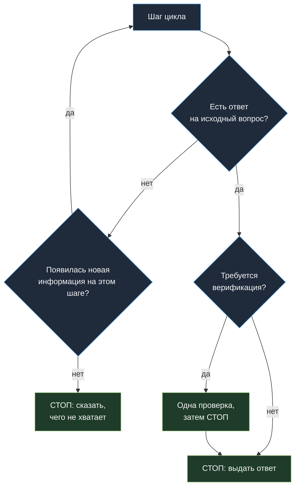
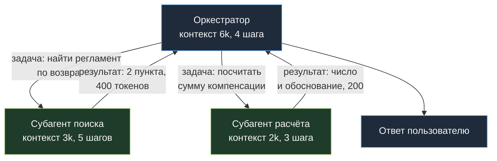

# 03. Эффективность агентного цикла: не дать контексту расти квадратично

[← 02. Входные токены](../02-input-tokens/README.md) · [К содержанию](../README.md) · [Дальше: 04. Выходные токены →](../04-output-tokens/README.md)

> **Главный вопрос модуля.** Сколько шагов делает ваш агент на типичную задачу — и сколько из них были нужны?

В одношаговом сценарии стоимость линейна. В агентном цикле каждый шаг тащит всю предыдущую историю, поэтому стоимость задачи растёт **квадратично** по числу шагов. Агент, который делает 16 шагов вместо 4, стоит не в четыре раза дороже, а примерно в десять.

**Критерий приёмки:** в логах есть `steps_per_task` и `cost_per_task`, у обеих метрик есть жёсткий верхний предел, при достижении которого задача корректно завершается со `stop_reason: budget`, а не жжёт бюджет молча.

---

## Содержание

- [03.1 Почему квадратично](#031-почему-квадратично)
- [03.2 Бюджеты как часть контракта агента](#032-бюджеты-как-часть-контракта-агента)
- [03.3 Критерий останова: главная экономия](#033-критерий-останова-главная-экономия)
- [03.4 Компакция истории без убийства кэша](#034-компакция-истории-без-убийства-кэша)
- [03.5 Субагенты: изоляция контекста](#035-субагенты-изоляция-контекста)
- [03.6 Параллельные вызовы инструментов](#036-параллельные-вызовы-инструментов)
- [03.7 Как это ломается](#037-как-это-ломается)
- [Упражнения](#упражнения)
- [Чек-лист приёмки](#чек-лист-приёмки)
- [Антиметрика модуля](#антиметрика-модуля)

---

## 03.1 Почему квадратично

Пусть шапка `H`, а каждый шаг добавляет к истории `d` токенов. На шаге `k` вход равен `H + k·d`. Суммарный вход за `N` шагов:

```
Σ = N·H + d·N·(N+1)/2
```

Второе слагаемое — квадратичное. Численно, при `H` = 4 000 и `d` = 800:

| Шагов | Суммарный вход | Во сколько раз дороже 4 шагов |
|---|---|---|
| 4 | 24 000 | ×1,0 |
| 8 | 60 800 | ×2,5 |
| 12 | 110 400 | ×4,6 |
| 20 | 248 000 | ×10,3 |
| 30 | 491 600 | ×20,5 |

Отсюда три вывода, определяющих всю работу с циклом:

1. **Кэш (модуль 01) убирает первое слагаемое** `N·H` почти полностью. Обязательное условие, но квадратичность остаётся.
2. **Единственный способ убрать квадратичность — сократить `N` и `d`.** `N` — критерием останова и лучшими инструментами. `d` — усечением результатов инструментов и компакцией.
3. **Хвост распределения по `N` — самая дорогая часть счёта.** Один зацикленный агент на 60 шагов стоит как сто нормальных задач.

---

## 03.2 Бюджеты как часть контракта агента

Бюджет — это не «защита от ошибок», а полноправная часть спецификации агента. Их должно быть четыре, и все четыре обязаны быть проверяемыми в коде.

```python
from dataclasses import dataclass

@dataclass
class Budget:
    max_steps: int = 12          # шагов цикла
    max_tokens_total: int = 200_000  # суммарный вход+выход на задачу
    max_cost_usd: float = 0.25   # деньги на задачу
    max_wall_ms: int = 60_000    # время на задачу

class BudgetExceeded(Exception):
    pass

class Meter:
    def __init__(self, budget: Budget):
        self.b, self.steps, self.tokens, self.cost, self.t0 = budget, 0, 0, 0.0, now_ms()

    def charge(self, usage, cost):
        self.steps += 1
        self.tokens += usage["input_tokens"] + usage["output_tokens"]
        self.cost += cost
        for name, cur, lim in (
            ("steps", self.steps, self.b.max_steps),
            ("tokens", self.tokens, self.b.max_tokens_total),
            ("cost", self.cost, self.b.max_cost_usd),
            ("wall", now_ms() - self.t0, self.b.max_wall_ms),
        ):
            if cur > lim:
                raise BudgetExceeded(name)
```

**Как обрабатывать исчерпание бюджета правильно.** Не «упасть с ошибкой» и не «молча вернуть что есть», а вернуть частичный результат с явным признаком:

```python
try:
    result = run_agent(task, meter)
except BudgetExceeded as e:
    result = {
        "status": "partial",
        "stop_reason": f"budget:{e}",
        "partial": collect_partial(state),   # что удалось выяснить
        "next_step_hint": suggest_next(state),
    }
    log_for_review(task_id, result)          # такие задачи разбираются глазами
```

**Значения по умолчанию, от которых можно стартовать:** `max_steps` — двойной медианный `steps_per_task` из бейзлайна; `max_cost_usd` — тройная медианная стоимость задачи. Не ставьте лимиты «с запасом в десять раз»: тогда они не защищают ни от чего.

---

## 03.3 Критерий останова: главная экономия

Самая частая причина лишних шагов — агент не знает, что задача уже решена. Он делает контрольную проверку, потом ещё одну, потом переспрашивает инструмент, который уже ответил.



Четыре приёма, каждый из которых снимает 1–3 шага со средней задачи:

| Приём | Как выглядит в промпте или коде | Экономия |
|---|---|---|
| **Явный критерий готовности** | «Задача решена, когда получены поля X, Y, Z. Как только они есть — отвечай, не проверяй повторно.» | 1–3 шага |
| **Детектор отсутствия прогресса** | в коде: если шаг не добавил новых данных (тот же вызов с теми же аргументами) — прерываем | убирает зацикливание |
| **Запрет повторных вызовов** | кэш вызовов инструментов внутри задачи: тот же вызов с теми же аргументами возвращает сохранённый результат бесплатно | 10–30% шагов |
| **Разрешение сказать «не знаю»** | «Если данных недостаточно — прямо скажи, чего не хватает, вместо новых попыток» | обрезает самые дорогие хвосты |

**Кэш вызовов инструментов внутри задачи** — недооценённый приём. Реализация в десять строк:

```python
def cached_call(state, name, args):
    key = (name, json.dumps(args, sort_keys=True, ensure_ascii=False))
    if key in state.tool_cache:
        return {**state.tool_cache[key], "_cached": True}
    res = TOOLS[name](**args)
    state.tool_cache[key] = res
    return res
```

Кроме экономии он даёт диагностику: если `_cached` срабатывает часто, значит агент ходит по кругу — и это повод править промпт, а не радоваться экономии.

---

## 03.4 Компакция истории без убийства кэша

Компакция — сжатие старой части диалога в короткое резюме. Она обязательна в длинных сессиях, но конфликтует с кэшем: переписывая начало истории, вы обнуляете префикс.

**Правильная политика компакции:**

| Параметр | Плохо | Хорошо |
|---|---|---|
| Когда компактить | каждый шаг | по порогу: заполнение контекста превысило 60–70% |
| Сколько сжимать | последние два хода | всю историю старше N последних ходов, крупным куском |
| Куда положить результат | в середину истории | в стабильный блок **выше** отметки кэша |
| Чем сжимать | верхней моделью | дешёвой моделью: это задача уровня «перескажи» |
| Что сохранять дословно | ничего | факты, идентификаторы, числа, решения; формулировки — нет |

```python
COMPACT_PROMPT = (
    "Сожми историю в структурированное резюме. Сохрани дословно: "
    "все идентификаторы, числа, даты, названия, принятые решения и незакрытые вопросы. "
    "Выброси: формулировки, вежливость, повторы, промежуточные рассуждения. "
    "Формат: факты списком, затем 'осталось сделать' списком."
)

def maybe_compact(state, limit=120_000, keep_last=6):
    if state.context_tokens < limit * 0.65:
        return state                    # не трогаем: кэш дороже сжатия
    old, tail = state.history[:-keep_last], state.history[-keep_last:]
    summary = cheap_llm.summarize(COMPACT_PROMPT, old)   # дешёвая модель
    state.history = tail
    state.pinned = summary              # уходит в кэшируемый блок
    state.compactions += 1
    return state
```

**Правило «не компакть чаще раза в 4–5 шагов».** Каждая компакция стоит: вызов модели плюс перезапись кэша (надбавка 1,25 на весь префикс). Если компактить каждый шаг, вы платите за кэш-записи больше, чем экономите на сокращении истории.

**Что нельзя терять при компакции.** Идентификаторы (номера заказов, id документов), числа, явные ограничения задачи, список того, что уже пробовали и не сработало. Последнее особенно важно: агент, потерявший память о неудачных попытках, повторяет их — и это самый дорогой вид забывчивости.

---

## 03.5 Субагенты: изоляция контекста

Главный экономический смысл субагентов — не «разделение труда», а **изоляция контекста**. Субагент получает узкую задачу, работает в своём маленьком контексте и возвращает наверх короткий результат. Грязная история его поисков не попадает в основной диалог и не оплачивается на каждом последующем шаге.



Сравнение на одной задаче: монолитный агент делает 14 шагов, к концу история 18 000 токенов, суммарный вход около 160 000. Оркестратор с двумя субагентами: 4 шага сверху при истории 6 000 плюс 8 шагов внизу при истории 3 000, суммарный вход около 60 000. **Разница примерно в 2,5 раза при том же результате.**

Когда субагенты **не** нужны и делают хуже:

- Задача простая и решается в 3–4 шага: накладные расходы на передачу задачи и результата больше экономии.
- Субагенту нужен почти весь контекст оркестратора: тогда изоляции не получится, а платить придётся дважды.
- Нет чёткого контракта результата: субагент возвращает простыню текста, и вы просто перенесли расход, а не убрали его.

**Обязательное правило:** у субагента свой бюджет из 03.2, и его исчерпание — не падение всей задачи, а частичный результат для оркестратора.

---

## 03.6 Параллельные вызовы инструментов

Если модель может запросить несколько независимых инструментов, обрабатывайте их **в одном шаге**, а не в трёх последовательных. Это экономит не токены модели, а **круги цикла** — то есть переотправку истории.

```python
# Плохо: три круга цикла, три раза оплачена вся история
# Хорошо: один круг, три результата инструментов в одном ответе
results = await asyncio.gather(*[
    run_tool(call) for call in message.tool_calls   # модель попросила сразу несколько
])
```

В промпте это стоит разрешить явно: «Если нужно несколько независимых справок — запрашивай их одновременно в одном ходе». Экономия на типичном агенте — 20–40% шагов, а вместе с ними и квадратичной части.

Ограничение: параллелить можно только независимые вызовы. Если второй вызов зависит от результата первого, параллель даст мусор и лишние деньги. Это проверяется тестами на траекторию: см. [00.5](../00-baseline/README.md).

---

## 03.7 Как это ломается

| Симптом | Причина | Лечение |
|---|---|---|
| `p95 cost_per_task` в 8 раз выше медианы | нет лимита шагов, редкие задачи зацикливаются | бюджеты из 03.2, детектор отсутствия прогресса |
| Агент вызывает один инструмент 5 раз с теми же аргументами | нет кэша вызовов, нет запрета на повтор | `cached_call` из 03.3 |
| После добавления компакции счёт вырос | компакция на каждом шаге, кэш обнуляется постоянно | порог 60–70%, крупные куски, редко |
| Субагенты не дали экономии | им передаётся весь контекст оркестратора | сузить контракт: только задача и минимум данных |
| Агент делает 3 круга там, где нужен 1 | последовательные независимые вызовы | разрешить и обрабатывать параллельные вызовы |
| Агент «дорешивает» уже решённую задачу | нет явного критерия готовности | критерий готовности в промпте, проверка в коде |
| Задачи стали дешевле, но `pass_rate` упал | лимит шагов слишком жёсткий | поднять лимит, смотреть на долю `stop_reason: budget` в успешных задачах |

Последняя строка — типичная ошибка чрезмерного затягивания гаек. Здоровая доля задач, упирающихся в бюджет: **1–3%.** Если их 15% — лимит слишком низкий и вы теряете качество. Если 0% — лимит не защищает, поставьте его ниже.

---

## Упражнения

<details>
<summary><b>1.</b> Шапка 4 000 токенов, прирост истории 800 за шаг. Кэш включён (чтение 0,1). Во сколько раз дороже 16 шагов, чем 6?</summary>

С кэшем шапка почти бесплатна, считаем историю: `d·N·(N+1)/2`.

6 шагов: 800 × 21 = 16 800 токенов. 16 шагов: 800 × 136 = 108 800.

**Примерно в 6,5 раза дороже** при увеличении числа шагов всего в 2,7 раза. Это и есть квадратичность: она никуда не уходит после включения кэша, поэтому модули 01 и 03 не заменяют друг друга.
</details>

<details>
<summary><b>2.</b> Медиана `steps_per_task` = 5, p95 = 22. Какой `max_steps` поставить?</summary>

Начните с 12 — примерно двойная медиана. Это отсечёт дорогой хвост, но затронет часть легитимно сложных задач, поэтому обязательно логируйте `stop_reason: budget` и смотрите, что это за задачи. Если среди них есть важные и решаемые — поднимайте лимит для конкретного класса задач, а не глобально. Полезный приём: **разные бюджеты для разных типов задач** — простой вопрос имеет право на 6 шагов, расследование инцидента на 25.
</details>

<details>
<summary><b>3.</b> Как отличить «агент честно работает» от «агент зациклился», не читая трейс глазами?</summary>

По прогрессу. Признаки зацикливания, все проверяются в коде: повторяющиеся вызовы с идентичными аргументами; отсутствие новых сущностей (идентификаторов, чисел, фактов) в результатах последних двух шагов; повторяющийся текст в размышлениях модели; отсутствие продвижения к критерию готовности (какие поля из требуемых уже собраны). Прерывайте по любому из этих признаков — дешевле разобрать частичный результат, чем оплатить 40 шагов.
</details>

<details>
<summary><b>4.</b> Компакция сжала историю в 10 раз, но счёт не изменился. Почему?</summary>

Скорее всего компакция срабатывает часто и каждый раз перезаписывает кэшированный префикс: экономия на длине истории компенсируется надбавкой за запись кэша плюс стоимостью самих вызовов на сжатие. Проверьте `cache_creation_input_tokens`: если они появляются на каждом шаге, вы платите за кэш заново. Лечение: порог по заполнению контекста, компакция крупными кусками, результат — в стабильный блок выше отметки кэша, сжатие дешёвой моделью.
</details>

<details>
<summary><b>5.</b> Стоит ли разбивать агента на субагентов, если задача решается в 4 шага?</summary>

Нет. Накладные расходы (передача задачи, свой промпт субагента, сборка результата) в таком масштабе больше экономии, а система становится сложнее в отладке. Субагенты начинают выигрывать примерно от 8–10 шагов монолитного цикла или там, где отдельный подпроцесс требует большого «грязного» контекста, который не должен попасть в основной диалог: просмотр логов, обход десятков файлов, длинный поиск.
</details>

---

## Чек-лист приёмки

- [ ] В логе есть `steps_per_task`, `cost_per_task`, `stop_reason`
- [ ] Заданы все четыре бюджета: шаги, токены, деньги, время
- [ ] Исчерпание бюджета возвращает частичный результат, а не исключение в лицо пользователю
- [ ] Есть явный критерий готовности задачи в промпте
- [ ] Реализован детектор отсутствия прогресса
- [ ] Работает кэш вызовов инструментов внутри задачи
- [ ] Независимые вызовы инструментов выполняются параллельно в одном шаге
- [ ] Компакция срабатывает по порогу, а не на каждом шаге, и не ломает кэш
- [ ] Компакция сохраняет идентификаторы, числа и список неудачных попыток
- [ ] У субагентов есть свои бюджеты и узкий контракт результата
- [ ] Доля задач, упирающихся в бюджет, находится в диапазоне 1–3%

---

## Антиметрика модуля

**Среднее число шагов.** Его легко улучшить, поставив `max_steps  3` — агент перестанет решать задачи, зато метрика будет прекрасной. Смотрите на `steps_per_task` **вместе** с `pass_rate` и долей `stop_reason: budget`.

Вторая антиметрика: **число субагентов в архитектуре.** Пять субагентов вокруг задачи на четыре шага — это не оптимизация, это распределённая версия той же проблемы плюс отладка в пять раз дороже.

---

[← 02. Входные токены](../02-input-tokens/README.md) · [К содержанию](../README.md) · [Дальше: 04. Выходные токены →](../04-output-tokens/README.md)
