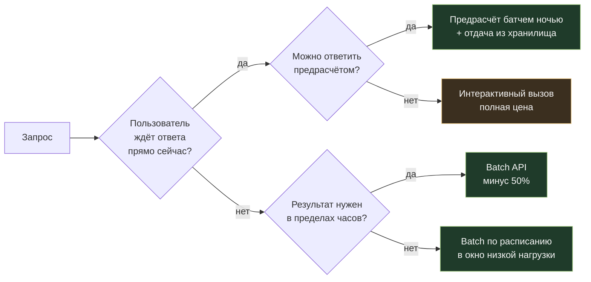
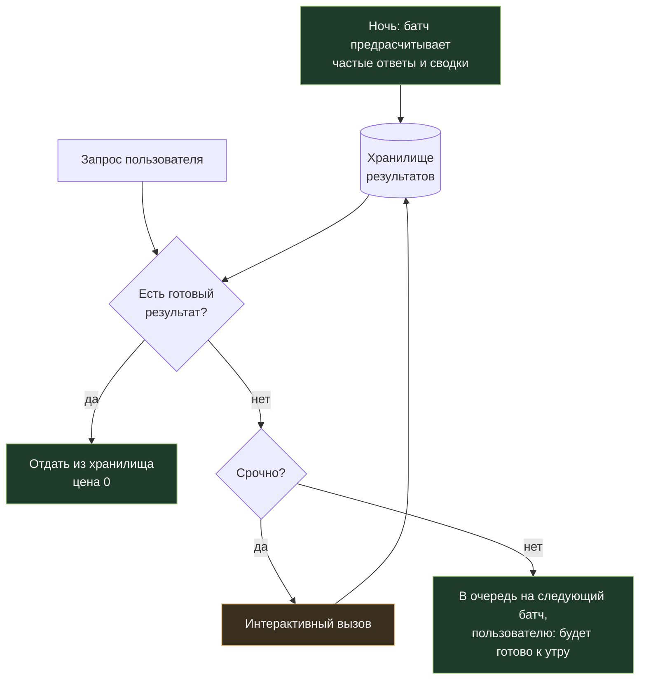

# 05. Batch API: минус половина цены за терпение

[← 04. Выходные токены](../04-output-tokens/README.md) · [К содержанию](../README.md) · [Дальше: 06. Выбор модели →](../06-model-selection/README.md)

> **Главный вопрос модуля.** Какая доля ваших запросов действительно требует ответа сейчас, а не через десять минут?

Обычно интерактивных запросов меньше, чем кажется: половина трафика — фоновые задачи, которые кто-то однажды сделал синхронными, потому что так было проще написать. Асинхронная очередь стоит примерно вдвое дешевле при том же качестве и той же модели.

**Критерий приёмки:** `make batch-demo` формирует файл запросов, отправляет пачку, дожидается результата, разбирает частичные ошибки и печатает сравнение «интерактивно против батча» по деньгам и времени.

---

## Содержание

- [05.1 Что можно отдать в батч прямо сегодня](#051-что-можно-отдать-в-батч-прямо-сегодня)
- [05.2 Экономика: где батч выигрывает и где нет](#052-экономика-где-батч-выигрывает-и-где-нет)
- [05.3 Как устроен пакетный запуск](#053-как-устроен-пакетный-запуск)
- [05.4 Проектирование задачи под батч](#054-проектирование-задачи-под-батч)
- [05.5 Частичные ошибки и повторы](#055-частичные-ошибки-и-повторы)
- [05.6 Гибридный режим: батч плюс интерактив](#056-гибридный-режим-батч-плюс-интерактив)
- [05.7 Как это ломается](#057-как-это-ломается)
- [Упражнения](#упражнения)
- [Чек-лист приёмки](#чек-лист-приёмки)
- [Антиметрика модуля](#антиметрика-модуля)

---

## 05.1 Что можно отдать в батч прямо сегодня

Пройдите по списку и найдите своё. Почти в каждом продукте есть минимум три пункта из этого перечня.

| Задача | Почему подходит | Обычная экономия |
|---|---|---|
| Классификация и разметка входящего потока (не в реальном времени) | результат нужен к отчёту, а не к секунде | 50% |
| Переиндексация базы знаний, генерация описаний и сводок | плановая работа | 50% |
| Ночная аналитика диалогов, поиск проблемных сессий | смотрят утром | 50% |
| Генерация карточек товаров, метаданных, альт-текстов | публикуется пачками | 50% |
| Прогон набора тестов и регрессий | никто не ждёт у экрана | 50% |
| Извлечение данных из архива документов | миграция, разовая или плановая | 50% |
| Предрасчёт частых ответов (FAQ, шаблоны писем) | заранее известно, что спросят | 50% плюс кэш ответов |
| Обогащение CRM, дедупликация записей | фоновая гигиена данных | 50% |
| Обучающие выборки, синтетические данные | оффлайн по определению | 50% |
| Массовая переоценка качества после смены промпта | пакетный эксперимент | 50% |

**Признак, по которому задача годится в батч:** между отправкой и потреблением результата есть человек, отчёт или расписание, а не ожидающий пользователь.

---

## 05.2 Экономика: где батч выигрывает и где нет



| Ситуация | Батч уместен | Комментарий |
|---|---|---|
| 200 000 документов на разметку | да | классический случай, экономия прямая |
| Чат с пользователем | нет | ожидание неприемлемо |
| Автодополнение в редакторе | нет | нужны миллисекунды |
| Ночной пересчёт рекомендаций | да | идеально |
| Модерация контента перед публикацией | зависит | если публикация не мгновенная — да |
| Агентная задача из 12 шагов | обычно нет | шаги зависят друг от друга; батчем отправляют независимые запросы |
| Прогон eval на 500 задач | да | и заодно перестанете жалеть деньги на тесты |

**Важный нюанс про агентов.** Многошаговый агент плохо ложится в батч, потому что каждый шаг зависит от предыдущего. Но **отдельные независимые подзадачи** внутри агентного процесса — ложатся: например, «оценить 40 найденных документов на релевантность» можно отправить одной пачкой вместо сорока последовательных вызовов.

**Батч и кэш складываются.** Если в пачке тысяча запросов с одинаковой шапкой, кэш работает внутри пачки: первый запрос пишет префикс, остальные читают. Половинная цена умножается на десятикратную экономию на префиксе. Именно так получаются те самые «в двадцать раз дешевле» в отчётах о массовой обработке.

---

## 05.3 Как устроен пакетный запуск

Схема одинаковая у всех провайдеров: сформировать файл запросов, отправить, опрашивать статус, скачать результаты, сопоставить по идентификаторам.

```python
# 1. Формируем запросы с устойчивыми идентификаторами
requests = [
    {
        "custom_id": f"doc-{d.id}",         # ваш ключ, по нему сопоставите результат
        "params": {
            "model": MODEL_CHEAP,
            "max_tokens": 200,
            "system": SYSTEM_STABLE,        # одинаковая шапка на всю пачку: кэш внутри батча
            "messages": [{"role": "user", "content": d.text[:MAX_CHARS]}],
        },
    }
    for d in documents
]

# 2. Отправляем пачками разумного размера
batch = client.messages.batches.create(requests=requests[:BATCH_LIMIT])

# 3. Опрашиваем без фанатизма: интервал секунды-минуты, а не миллисекунды
while (b := client.messages.batches.retrieve(batch.id)).processing_status != "ended":
    time.sleep(POLL_SECONDS)

# 4. Разбираем результаты по одному, не падая на первой ошибке
ok, failed = [], []
for item in client.messages.batches.results(batch.id):
    if item.result.type == "succeeded":
        ok.append((item.custom_id, item.result.message))
    else:
        failed.append((item.custom_id, item.result.type))
```

Практические правила:

1. **`custom_id` — детерминированный и осмысленный.** Не индекс в списке, а идентификатор сущности: список поменяется, идентификатор нет.
2. **Одинаковая шапка на всю пачку** — тогда кэш работает внутри батча.
3. **Опрос по расписанию, а не в бесконечном цикле** с миллисекундным интервалом: результат всё равно готовится минуты и часы.
4. **Идемпотентность записи.** Результат может прийти дважды при повторном разборе; `upsert` по `custom_id`, а не `insert`.
5. **Разбирайте потоково,** не загружая все результаты в память: пачки бывают на сотни тысяч записей.

---

## 05.4 Проектирование задачи под батч

Батч меняет не только цену, но и стиль работы. Три следствия, которые надо учесть в архитектуре.

**Следствие 1. Нет диалога — значит промпт должен быть самодостаточным.** Нельзя «уточнить у пользователя». Всё, что нужно для решения, должно быть в запросе, а неоднозначные случаи должны иметь заранее определённый выход: поле `needs_review: true` вместо попытки угадать.

**Следствие 2. Нет инструментов — или они должны быть заранее разрешены.** Если задача требует походов в базу, батчем идёт только та часть, которая работает с уже собранными данными. Собрать данные — отдельный дешёвый шаг вашего кода.

**Следствие 3. Ошибки собираются, а не бросаются.** Пачка на 50 000 запросов почти наверняка даст десятки сбоев. Это нормально и должно быть предусмотрено в дизайне, а не обнаружено в проде.

Схема разделения работы:

| Этап | Где выполняется | Стоимость |
|---|---|---|
| Отбор кандидатов, фильтрация, дедупликация | ваш код, без модели | почти ноль |
| Сборка контекста для каждой записи | ваш код | ноль |
| Основная работа модели | батч | половина цены |
| Валидация результата по схеме | ваш код | ноль |
| Разбор неуверенных случаев (`needs_review`) | интерактивно, дорогая модель, малый объём | небольшая |

Такое разделение даёт типичную структуру расходов: 90% объёма проходит по половинной цене на дешёвой модели, а 3–7% сложных случаев эскалируются на дорогую — и общая цена оказывается ближе к дешёвой модели, чем к дорогой, при качестве, близком к дорогой.

---

## 05.5 Частичные ошибки и повторы

Пакетная обработка обязана быть **возобновляемой**. Минимальная реализация состояния:

```python
# состояние в таблице: одна строка на запись
# (custom_id PRIMARY KEY, status, attempts, batch_id, result, error, updated_at)

def enqueue_pending(all_ids, limit):
    return db.query(
        "select custom_id from work where status in ('pending','failed') "
        "and attempts < 3 order by updated_at limit ?", limit
    )

def absorb(batch_id):
    for item in client.messages.batches.results(batch_id):
        if item.result.type == "succeeded":
            payload = validate(item.result.message)          # схема обязательна
            db.upsert(item.custom_id, status="done", result=payload)
        else:
            db.bump_attempt(item.custom_id, error=item.result.type)
```

| Тип сбоя | Что делать |
|---|---|
| Невалидный JSON в ответе | повтор с более строгим промптом и префиллом; после третьей попытки — в ручной разбор |
| Превышение лимита длины запроса | нарезать запись на части заранее, а не в момент отправки |
| Единичные технические ошибки | повтор в следующей пачке; экспоненциальная задержка не нужна, пачки и так идут с интервалом |
| Систематическая ошибка на классе записей | остановить прогон: чинить надо промпт, а не повторять 40 000 раз |
| Результат не пришёл вовсе | по `custom_id` видно, что записи остались `pending` — они уйдут в следующую пачку |

**Правило стоп-крана.** Если доля сбоев в пачке превысила порог (например, 5%), не отправляйте следующую пачку автоматически. Массовая обработка с систематической ошибкой — самый быстрый способ потратить бюджет месяца за одну ночь и получить 200 000 записей мусора.

**Правило пробной пачки.** Перед прогоном на 200 000 записей отправьте 200. Проверьте глазами двадцать результатов и схемой все двести. Стоимость пробы — тысячная доля процента, цена ошибки без пробы — весь прогон.

---

## 05.6 Гибридный режим: батч плюс интерактив

Самая практичная архитектура для продуктов с ожиданием пользователя.



Три сценария, где гибрид даёт больше всего:

1. **Предрасчёт по прогнозируемым запросам.** Если 40% вопросов — из тридцати повторяющихся тем, посчитайте ответы ночью и отдавайте из хранилища бесплатно. Обновляйте раз в сутки.
2. **Отложенные тяжёлые операции.** «Собрать отчёт по всему проекту» — не то, что нужно за две секунды. Явное «отчёт будет готов через 20 минут, пришлём уведомление» экономит половину цены и часто устраивает пользователя лучше, чем ожидание с крутящимся индикатором.
3. **Догоняющее уточнение.** Быстрый дешёвый ответ сейчас, точный — батчем позже, с уведомлением «мы уточнили результат». Работает в аналитике и отчётности, не работает там, где ответ нужен один раз и навсегда.

---

## 05.7 Как это ломается

| Симптом | Причина | Лечение |
|---|---|---|
| Батч включили, экономии нет | в батч ушла малая доля объёма; основной трафик остался интерактивным | посчитать долю объёма в батче, а не число задач |
| Результаты не сопоставляются с записями | `custom_id` был индексом в списке, список изменился | детерминированный `custom_id` из идентификатора сущности |
| Пачка «зависла» | опрос сломался или процесс перезапустился | состояние в базе, возобновление по `status`, а не в памяти процесса |
| Дубли в результатах | `insert` вместо `upsert` при повторном разборе | идемпотентная запись по `custom_id` |
| Прогнали 100 000 записей с ошибкой в промпте | не было пробной пачки и стоп-крана | 200 записей на пробу, порог сбоев, ручная проверка выборки |
| Кэш внутри пачки не работает | у каждой записи своя шапка (например, персональные данные вверху) | одинаковый префикс на пачку, переменное — в конец запроса |
| Пользователи жалуются на задержки | в батч отправили то, что ждут в интерфейсе | пересмотреть границу «срочно / не срочно», гибридный режим |

---

## Упражнения

<details>
<summary><b>1.</b> 400 000 документов, 1 800 входных и 150 выходных токенов на документ, дешёвый тариф 0,80/4,00 $. Сколько стоит интерактивно и сколько батчем?</summary>

Вход: 400 000 × 1 800 = 720 млн токенов → 720 × 0,80 = **576 $**.
Выход: 400 000 × 150 = 60 млн → 60 × 4,00 = **240 $**.
Интерактивно: **816 $**. Батчем: **408 $**.

Добавим кэш на общую шапку. Если из 1 800 токенов 1 200 — стабильная инструкция, то внутри пачки она читается со скидкой: вход падает примерно до 300 млн токенов → 240 $ вместо 576 $. Итого с батчем и кэшем: примерно **(240 + 240) × 0,5 = 240 $** против 816 $ — **в 3,4 раза дешевле** без смены модели.
</details>

<details>
<summary><b>2.</b> Почему батч плохо подходит для агента из 12 шагов, но подходит для его части?</summary>

Потому что шаг `k+1` зависит от результата шага `k`: отправить их одной пачкой нельзя, а отправлять по одному шагу в батч бессмысленно — вы получите задержку в минуты на каждый шаг. Зато **веерные подзадачи** внутри шага (оценить 40 документов, проверить 25 гипотез, извлечь поля из 60 файлов) — идеальный кандидат: они независимы, их много, и они не нужны пользователю по одному.
</details>

<details>
<summary><b>3.</b> В пачке 50 000 запросов, 6% вернулись с ошибкой валидации схемы. Что делать?</summary>

Сначала посмотреть, **однородны ли ошибки**. Если проваливаются записи одного типа (например, все документы длиннее 40 страниц) — это систематическая ошибка: остановить прогон, починить нарезку или промпт, перезапустить только эти записи. Если ошибки случайны — повторить их в следующей пачке с более строгим промптом и префиллом, ограничив число попыток тремя, а остаток отправить в ручной разбор. И в любом случае сработать стоп-краном до отправки следующей большой пачки: 6% выше типичного порога.
</details>

<details>
<summary><b>4.</b> Как убедить продукт, что «через 15 минут» лучше, чем «сейчас»?</summary>

Показать цифры и предложить обмен. Половина цены на этом сценарии — это конкретная сумма в месяц; часто её достаточно, чтобы оплатить дорогую модель там, где качество действительно важно. Плюс пользователю обычно не нужен отчёт «сейчас» — ему нужно **не ждать перед экраном**. Асинхронный сценарий с уведомлением «готово» часто воспринимается лучше, чем 40 секунд с индикатором загрузки. Правильная формулировка обмена: «мы делаем отчёты вдвое дешевле и за счёт этого ставим на них более умную модель».
</details>

<details>
<summary><b>5.</b> Какую долю объёма надо перевести в батч, чтобы это дало заметный эффект?</summary>

Считайте не долю запросов, а долю **токенов**. Экономия равна половине от доли токенов, ушедших в батч. Перевели 20% токенов — сэкономили 10% счёта. Перевели 60% — сэкономили 30%. Именно поэтому первым делом надо смотреть на массовые фоновые задачи с большим объёмом контекста, а не на редкие «удобные» кандидаты вроде ночного отчёта из десяти запросов.
</details>

---

## Чек-лист приёмки

- [ ] Составлен список фоновых задач и посчитана их доля в токенах
- [ ] Массовые задачи отправляются через пакетный API
- [ ] `custom_id` детерминированный, из идентификатора сущности
- [ ] Шапка одинаковая на всю пачку, кэш работает внутри батча
- [ ] Состояние обработки хранится в базе, прогон возобновляемый
- [ ] Запись результатов идемпотентная (`upsert` по `custom_id`)
- [ ] Каждый результат валидируется по схеме перед записью
- [ ] Есть лимит попыток и очередь ручного разбора
- [ ] Работает стоп-кран по доле сбоев
- [ ] Перед большим прогоном отправляется пробная пачка на 100–200 записей
- [ ] Для интерактивных сценариев рассмотрен предрасчёт частых ответов

---

## Антиметрика модуля

**Доля запросов, отправленных батчем.** Можно отправить туда все дешёвые мелкие запросы, оставить интерактивными все тяжёлые и получить прекрасную метрику при нулевой экономии. Считайте **долю токенов**, а не запросов.

Вторая антиметрика: **скорость обработки пачки.** Гнаться за тем, чтобы батч отработал за две минуты, — значит не понимать, за что вы получили скидку. Смотрите на `cost_per_success` и на долю записей, дошедших до `done` с первой попытки.

---

[← 04. Выходные токены](../04-output-tokens/README.md) · [К содержанию](../README.md) · [Дальше: 06. Выбор модели →](../06-model-selection/README.md)
