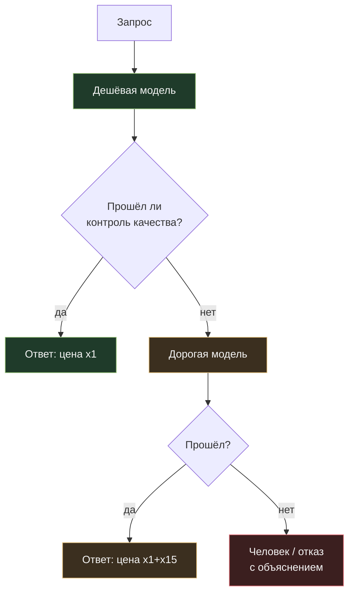

# 06. Выбор модели и уровень усилий: последний рычаг, а не первый

[← 05. Batch API](../05-batch-api/README.md) · [К содержанию](../README.md) · [Дальше: 07. Архитектура →](../07-architecture/README.md)

> **Главный вопрос модуля.** Какая самая дешёвая модель проходит ваш порог качества — и на каких задачах она его не проходит?

Это самый простой рычаг: одна строка конфигурации, минус 60–90% счёта. И самый опасный: он напрямую снижает потолок интеллекта продукта. Поэтому он идёт последним — когда все бесплатные способы уже применены и вы точно знаете, чем платите за экономию.

**Критерий приёмки:** есть таблица «модель × класс задач → `pass_rate` и `cost_per_success`», маршрутизация настроена по классам задач, а не глобально, и работает эскалация: провал на дешёвой модели уходит на дорогую автоматически.

---

## Содержание

- [06.1 Правильный порядок вопросов](#061-правильный-порядок-вопросов)
- [06.2 Матрица «класс задачи → уровень модели»](#062-матрица-класс-задачи--уровень-модели)
- [06.3 Каскад: дешёвая с эскалацией](#063-каскад-дешёвая-с-эскалацией)
- [06.4 Математика каскада](#064-математика-каскада)
- [06.5 Маршрутизатор: как выбирать модель до вызова](#065-маршрутизатор-как-выбирать-модель-до-вызова)
- [06.6 Уровень усилий и бюджет размышлений](#066-уровень-усилий-и-бюджет-размышлений)
- [06.7 Как это ломается](#067-как-это-ломается)
- [Упражнения](#упражнения)
- [Чек-лист приёмки](#чек-лист-приёмки)
- [Антиметрика модуля](#антиметрика-модуля)

---

## 06.1 Правильный порядок вопросов

Прежде чем понижать модель, ответьте на четыре вопроса. Если хотя бы на один ответ «нет» — вы ещё не заработали право трогать этот рычаг.

1. **Кэш работает?** `cache_read_input_tokens` составляют большую часть входа в многошаговых сценариях. → [01](../01-prompt-caching/README.md)
2. **Контекст почищен?** Аудит промпта проведён, результаты инструментов усечены. → [02](../02-input-tokens/README.md)
3. **Цикл ограничен?** Есть бюджеты, критерий останова, кэш вызовов инструментов. → [03](../03-agent-loop/README.md)
4. **Выход в узде?** `out/in` в норме, формат вместо прозы, размышления по классу задач. → [04](../04-output-tokens/README.md)

Причина такого порядка простая: рычаги 1–5 **не влияют на качество**, а этот влияет. Сначала бесплатное, потом то, за что платят качеством.

**Отдельно про «начать с дорогой модели».** При разработке нового сценария всегда начинайте с самой способной модели: сначала добейтесь, чтобы задача решалась вообще, зафиксируйте потолок качества, соберите набор тестов. Только потом спускайтесь вниз по уровням и смотрите, где `pass_rate` проваливается ниже порога. Обратный путь — «начнём с дешёвой, потом улучшим» — обычно заканчивается тем, что команда месяцами борется с промптом задачи, которая на способной модели решается сразу.

---

## 06.2 Матрица «класс задачи → уровень модели»

Уровни здесь абстрактные: `cheap` (быстрая дешёвая), `balanced` (рабочая лошадка), `premium` (верхний интеллект). Подставьте свои модели.

| Класс задачи | Уровень | Почему |
|---|---|---|
| Классификация по 3–10 категориям | cheap | формальная задача, разброс между уровнями минимален |
| Извлечение полей из документа по схеме | cheap | при хорошей схеме и примерах дешёвая модель почти не уступает |
| Маршрутизация запроса, определение интента | cheap | короткий вход, короткий выход, тысячи вызовов |
| Компакция и резюмирование истории | cheap | это работа уровня «перескажи» |
| Судья в eval по простой рубрике | cheap | судья не должен стоить дороже подсудимого |
| Ответ на типовой вопрос по найденному фрагменту | balanced | нужна аккуратность формулировок |
| Диалог с пользователем в поддержке | balanced | нужен здравый смысл, но не глубокие рассуждения |
| Планирование действий агента | balanced или premium | ошибка плана стоит нескольких лишних шагов |
| Написание и правка кода | balanced или premium | цена ошибки высокая, проверка дорогая |
| Разбор инцидента, анализ противоречий, длинные цепочки выводов | premium | здесь и живёт разница между уровнями |
| Работа с юридическими и финансовыми последствиями | premium | цена ошибки несоизмерима с ценой токенов |

**Как заполнить эту таблицу для себя.** Возьмите набор тестов, разметьте задачи по классам, прогоните каждый класс на каждом уровне. Вы получите не абстрактное «модель X лучше», а конкретное «на извлечении полей разница 1 пункт, на разборе инцидентов — 22 пункта». Дальше решение принимается само.

---

## 06.3 Каскад: дешёвая с эскалацией

Самая практичная схема: сначала дешёвая модель, при признаках неуверенности — дорогая.



**Контроль качества — сердце каскада.** Он должен быть дешёвым и формальным, иначе весь смысл теряется:

| Способ контроля | Стоимость | Где применим |
|---|---|---|
| Валидация по схеме (JSON, типы, диапазоны) | ноль | извлечение данных, классификация |
| Проверка вычислений своим кодом | ноль | всё, где есть арифметика |
| Проверка ссылок: цитата реально есть в источнике | ноль | RAG, работа с документами |
| Явное поле `confidence` или `needs_review` от модели | почти ноль | везде, но требует калибровки |
| Согласие двух дешёвых прогонов | ×2 дешёвой модели | классификация с высокой ценой ошибки |
| Судья на дешёвой модели по короткой рубрике | небольшая | там, где нет формальной проверки |

**Ключевое требование:** контроль должен ловить именно те ошибки, которые делает дешёвая модель. Проверять валидность JSON бессмысленно, если дешёвая модель ошибается не в формате, а в существе. Сначала посмотрите на её реальные ошибки в наборе тестов, потом проектируйте контроль.

---

## 06.4 Математика каскада

Пусть `p` — доля запросов, которые дешёвая модель решает правильно и это подтверждено контролем; `C_cheap` и `C_exp` — цены.

```
цена_каскада = C_cheap + (1 − p) × C_exp
```

При `C_cheap` = 0,006 $, `C_exp` = 0,041 $:

| p (доля, решённая дешёвой) | Цена каскада | Против чистой дорогой |
|---|---|---|
| 0,50 | 0,0265 $ | −35% |
| 0,70 | 0,0183 $ | −55% |
| 0,85 | 0,0122 $ | −70% |
| 0,95 | 0,0081 $ | −80% |

Три вывода:

1. **Каскад выгоден начиная примерно с `p` = 0,4.** Ниже — вы просто платите дважды за большинство запросов.
2. **Главный параметр — не цена модели, а точность контроля.** Если контроль пропускает плохие ответы, вы получаете дешёвый и плохой продукт. Если он ложно срабатывает, вы платите за оба вызова почти всегда.
3. **Каскад повышает задержку** на тех запросах, где произошла эскалация. В интерактивных сценариях это надо учитывать: пользователь ждёт два вызова вместо одного.

**Антипаттерн «каскад без контроля»:** отправить в дешёвую модель, а потом всё равно в дорогую «для проверки». Это стоит дороже, чем сразу дорогая. Каскад существует только вместе с дешёвым и точным контролем.

---

## 06.5 Маршрутизатор: как выбирать модель до вызова

Каскад реагирует на провал. Маршрутизатор пытается угадать заранее — и в простых случаях делает это почти бесплатно.

```python
# Правила сначала, модель-классификатор потом. Порядок важен:
# 80% маршрутизации закрывается детерминированными правилами.
def route(task) -> str:
    if task.type in ("classify", "extract", "route", "summarize_history"):
        return "cheap"
    if task.type in ("incident_analysis", "legal", "finance_calc"):
        return "premium"
    if task.input_tokens > 60_000 or task.requires_planning:
        return "premium"
    if task.retry_count > 0:                 # первая попытка провалилась
        return "premium"                     # не повторяем то же самое той же моделью
    return "balanced"
```

| Признак маршрутизации | Куда | Комментарий |
|---|---|---|
| Тип задачи из фиксированного перечня | по таблице 06.2 | самый надёжный признак, ноль стоимости |
| Повторная попытка после провала | вверх | повтор той же моделью с тем же промптом почти всегда даёт тот же провал |
| Очень длинный вход | вверх | на длинном контексте разрыв между уровнями растёт |
| Явный признак сложности в запросе («почему», «сравни», «докажи») | вверх | грубая эвристика, но работает |
| Клиент с высоким тарифом / критичный сценарий | вверх | продуктовое решение, а не инженерное |
| Внутренние фоновые задачи | вниз | их никто не читает по одной |
| Классификатор-модель на дешёвом уровне | по её вердикту | последнее средство: добавляет вызов и задержку |

**Правило.** Сначала правила по типу задачи — они бесплатны и объяснимы. Модель-маршрутизатор добавляйте только если правил недостаточно, и обязательно измерьте, что она окупается: лишний вызов плюс задержка против экономии на неправильно выбранном уровне.

**Важный частный случай — повторная попытка.** Если запрос провалился, повторять его той же моделью с тем же промптом бессмысленно: результат детерминирован настолько, что вы почти наверняка получите тот же провал и заплатите дважды. Ретрай должен **что-то менять**: уровень модели, промпт, объём контекста. Иначе это не ретрай, а покупка второго билета на тот же неудачный рейс.

---

## 06.6 Уровень усилий и бюджет размышлений

Внутри одной модели тоже есть регулятор цены: сколько модели разрешено «думать». Это отдельный рычаг между «дешёвая модель» и «дорогая модель», и часто он выгоднее смены модели.

| Настройка | Эффект на цену | Эффект на качество |
|---|---|---|
| Размышления выключены | базовая | падает на многошаговых рассуждениях, не меняется на извлечении и классификации |
| Небольшой бюджет | +20…50% выхода | обычно закрывает 90% выигрыша от размышлений |
| Большой бюджет | ×2…×5 выхода | заметен только на действительно сложных задачах |

**Порядок подбора, который экономит больше всего:**

1. Выключить размышления на всех формальных задачах (классификация, извлечение, форматирование, компакция). Часто это половина трафика и там они не нужны вовсе.
2. На сложных задачах подобрать бюджет по кривой «`pass_rate` против `cost_per_task`» и взять точку начала плато (см. [04.4](../04-output-tokens/README.md)).
3. Сравнить два варианта на одном наборе задач: **дорогая модель без размышлений** против **средней модели с большим бюджетом размышлений**. Ответ неочевиден и зависит от задачи — иногда вторая конфигурация даёт то же качество вдвое дешевле. Это одно из самых недооценённых сравнений в оптимизации стоимости.

**Что не работает:** глобально выкрутить размышления на минимум «ради экономии». Вы получите ровный минус в качестве на сложных задачах и почти никакой экономии на простых, где размышления и так почти не тратились.

---

## 06.7 Как это ломается

| Симптом | Причина | Лечение |
|---|---|---|
| Понизили модель, счёт упал, через месяц вырос | пользователи переспрашивают, число запросов выросло | смотреть `cost_per_success` и число запросов на задачу, а не цену вызова |
| Каскад стоит дороже, чем чистая дорогая модель | контроль слишком строгий, эскалируется почти всё | измерить долю эскалаций; выше 50% — каскад не нужен |
| Каскад дал дешёвый и плохой продукт | контроль не ловит настоящие ошибки дешёвой модели | посмотреть реальные ошибки в наборе тестов, перепроектировать контроль |
| Маршрутизатор-модель съел экономию | лишний вызов на каждый запрос | заменить на правила по типу задачи |
| Дешёвая модель не понимает инструменты | схемы рассчитаны на способную модель | упростить схемы, добавить примеры вызовов, сократить число инструментов до 5–7 |
| После смены модели сломался кэш | кэш не переносится между моделями | учитывать в расчётах: у каждой ветки каскада свой кэш |
| Ретраи не помогают | повтор той же моделью с тем же промптом | ретрай обязан менять уровень, промпт или контекст |
| Качество упало только на длинных запросах | разрыв между уровнями растёт с длиной контекста | маршрутизация по длине входа |

---

## Упражнения

<details>
<summary><b>1.</b> Дешёвая модель решает 82% задач с проверяемым контролем. Цены 0,006 и 0,041 $. Считать каскад?</summary>

Цена каскада: 0,006 + 0,18 × 0,041 = **0,0134 $** против 0,041 $ у чистой дорогой — экономия 67%. Да, стоит.

Но обязательно проверьте два числа перед внедрением: **точность контроля** (какая доля плохих ответов дешёвой модели проходит контроль — именно они станут дефектами в проде) и **влияние на p95 задержки** (18% запросов теперь идут через два вызова).
</details>

<details>
<summary><b>2.</b> Почему нельзя выбирать модель по общему `pass_rate` на всём наборе задач?</summary>

Потому что средняя цифра скрывает структуру. Дешёвая модель может давать 0,88 в среднем: 0,97 на классификации (70% трафика) и 0,55 на разборе сложных случаев (30% трафика). Правильное решение — не «взять дешёвую» и не «взять дорогую», а **разделить по классам задач**: классификация уходит на дешёвую, разбор на дорогую. Средняя цифра приводит к неверному решению в обе стороны.
</details>

<details>
<summary><b>3.</b> Что сравнить перед тем, как переходить на дорогую модель ради качества?</summary>

Три конфигурации на одном наборе: средняя модель с большим бюджетом размышлений; средняя модель с улучшенным промптом и примерами; дорогая модель как есть. Очень часто первые две дают качество дорогой за меньшие деньги — потому что узкое место было не в модели, а в размышлениях или в описании задачи. Дорогая модель — валидный ответ, но проверять его надо последним.
</details>

<details>
<summary><b>4.</b> Как понять, что вы упёрлись в модель, а не в инженерию?</summary>

Признаки: качество не растёт при увеличении контекста и улучшении промпта; ошибки не формальные, а смысловые (модель не удерживает длинную цепочку выводов, путает похожие сущности, не замечает противоречий); разрыв с верхней моделью на вашем наборе больше 10–15 пунктов и он сосредоточен именно в сложных задачах. Если же ошибки — «не тот формат», «не вызвал нужный инструмент», «не увидел данные» — это инженерия, и смена модели её не вылечит, а только замаскирует.
</details>

<details>
<summary><b>5.</b> Дешёвая модель на классификации даёт 0,97, дорогая 0,99. Трафик 2 млн запросов в месяц. Что выбрать?</summary>

Считайте цену двух дополнительных пунктов. 2% от 2 млн — это 40 000 неверных классификаций в месяц. Дальше вопрос к продукту: сколько стоит одна ошибка? Если это маршрутизация обращения, которую живой оператор переназначит за минуту, — берите дешёвую и вложите разницу в качество там, где ошибка дорогая. Если это автоматическое списание денег или блокировка аккаунта — берите дорогую, а лучше дешёвую плюс контроль плюс эскалацию сомнительных случаев.

Смысл: **выбор модели — не инженерное, а продуктовое решение с посчитанной ценой ошибки.**
</details>

---

## Чек-лист приёмки

- [ ] Рычаги 1–5 применены до того, как трогается выбор модели
- [ ] Есть таблица «модель × класс задач → `pass_rate`, `cost_per_success`»
- [ ] Маршрутизация настроена по классам задач, а не глобально
- [ ] Маршрутизация построена на правилах; модель-маршрутизатор добавлена только если правила не справились
- [ ] Каскад имеет дешёвый формальный контроль, спроектированный под реальные ошибки дешёвой модели
- [ ] Доля эскалаций измеряется и находится ниже 50%
- [ ] Ретрай меняет уровень модели, промпт или контекст, а не повторяет то же самое
- [ ] Размышления выключены на формальных задачах
- [ ] Бюджет размышлений подобран по кривой качество/цена
- [ ] Сравнены «дорогая без размышлений» и «средняя с размышлениями»
- [ ] Влияние каскада на p95 задержки измерено и приемлемо для продукта

---

## Антиметрика модуля

**Доля запросов на дешёвой модели.** Эту метрику можно довести до 100% за одну строку конфигурации и получить продукт, который не работает. Она не говорит ничего о ценности.

Смотрите пару: **`cost_per_success` и `pass_rate` по каждому классу задач отдельно.** И держите в голове главное правило гайда: экономия, купленная за качество, — это не оптимизация, а понижение продукта. Оптимизация — это когда цена упала, а качество осталось.

---

[← 05. Batch API](../05-batch-api/README.md) · [К содержанию](../README.md) · [Дальше: 07. Архитектура →](../07-architecture/README.md)
