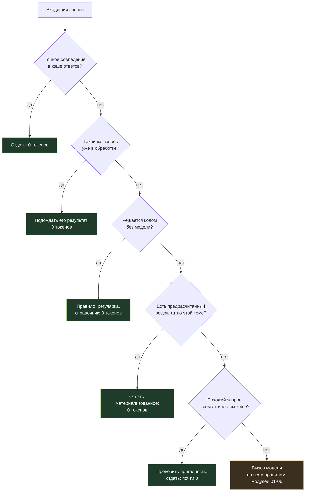

# 07. Архитектурные приёмы: не звонить в модель вообще

[← 06. Выбор модели](../06-model-selection/README.md) · [К содержанию](../README.md) · [Дальше: 08. Наблюдаемость →](../08-monitoring/README.md)

> **Главный вопрос модуля.** Какая доля вызовов модели вообще не должна была случиться?

Самый дешёвый токен — тот, который вы не отправили. В этом модуле собраны приёмы уровня системы, а не промпта: кэш ответов, дедупликация, предрасчёт, отложенная материализация, ограничители. Они дают эффект, который не получить настройкой промпта, но требуют изменений в архитектуре.

**Критерий приёмки:** на дашборде есть метрика `llm_calls_avoided` — сколько вызовов было предотвращено кэшем ответов, дедупликацией и предрасчётом, и сколько это денег.

---

## Содержание

- [07.1 Иерархия «не звонить в модель»](#071-иерархия-не-звонить-в-модель)
- [07.2 Кэш ответов: точный и семантический](#072-кэш-ответов-точный-и-семантический)
- [07.3 Дедупликация запросов](#073-дедупликация-запросов)
- [07.4 Предрасчёт и материализация](#074-предрасчёт-и-материализация)
- [07.5 Ограничители расходов как часть системы](#075-ограничители-расходов-как-часть-системы)
- [07.6 Деградация вместо отказа](#076-деградация-вместо-отказа)
- [07.7 Как это ломается](#077-как-это-ломается)
- [Упражнения](#упражнения)
- [Чек-лист приёмки](#чек-лист-приёмки)
- [Антиметрика модуля](#антиметрика-модуля)

---

## 07.1 Иерархия «не звонить в модель»



Порядок ступеней — это порядок внедрения: каждая следующая сложнее и рискованнее предыдущей. Первые три почти всегда безопасны, пятая требует осторожности.

| Ступень | Сложность | Риск | Типичная доля отсечённых вызовов |
|---|---|---|---|
| Точный кэш ответов | низкая | низкий | 5–40% (сильно зависит от продукта) |
| Дедупликация одновременных | низкая | нет | 1–15%, в пиках больше |
| Решение кодом | низкая | нет | 5–30% |
| Предрасчёт частых тем | средняя | низкий | 10–50% в справочных сценариях |
| Семантический кэш | средняя | **средний** | 5–25% |

---

## 07.2 Кэш ответов: точный и семантический

**Точный кэш** — хранение ответа по хэшу полного запроса. Прост, безопасен, недооценён.

```python
def answer(req):
    key = sha256(json.dumps(
        {"model": req.model, "system_v": SYSTEM_VERSION, "msgs": req.messages,
         "tools_v": TOOLS_VERSION, "params": req.params},
        sort_keys=True, ensure_ascii=False).encode()).hexdigest()

    if (hit := store.get(key)) and not stale(hit):
        metrics.incr("llm_calls_avoided"); return hit.value

    val = call_model(req)
    store.set(key, val, ttl=ttl_for(req))     # TTL по типу задачи
    return val
```

Три обязательных детали, без которых точный кэш опасен:

1. **Версия промпта и схем инструментов входит в ключ.** Иначе после релиза вы месяц отдаёте ответы старой логики.
2. **TTL по типу данных.** Справочный ответ про политику возвратов живёт сутки. Ответ про статус заказа — не кэшируется вообще.
3. **Никогда не кэшируйте персонализированные ответы в общем кэше.** Ключ должен включать идентификатор арендатора или пользователя, если ответ зависит от их данных. Утечка ответа между пользователями — это инцидент безопасности, а не экономия.

**Семантический кэш** — поиск похожего запроса по эмбеддингам и переиспользование ответа. Мощно и опасно одновременно.

| Условие применения | Почему обязательно |
|---|---|
| Высокий порог близости, подобранный на данных | «Как отменить заказ» и «Как отменить подписку» близки по вектору и полностью различны по смыслу |
| Ответ не зависит от данных конкретного пользователя | иначе выдадите чужие детали |
| Дешёвая верификация пригодности | быстрая проверка «этот ответ отвечает на этот вопрос?» на дешёвой модели или по правилам |
| Замер доли ложных попаданий на наборе тестов | без него вы не знаете, сколько вреда приносите |
| Возможность отключить одним флагом | первое, что выключают при жалобах на неточные ответы |

**Практический совет.** Начните с точного кэша по нормализованному запросу (нижний регистр, убранная пунктуация, свёрнутые пробелы). Он забирает значительную часть повторов почти без риска. Семантический добавляйте только если этого мало и вы готовы измерять ложные попадания.

---

## 07.3 Дедупликация запросов

Две ситуации, где вы платите дважды за одно и то же — и обе легко чинятся.

**Ситуация 1. Одновременные идентичные запросы.** Пользователь дважды нажал кнопку; десять экземпляров сервиса одновременно обрабатывают одно событие; кто-то обновил страницу. Решение — **single-flight**: первый запрос идёт в модель, остальные ждут его результат.

```python
_inflight: dict[str, asyncio.Future] = {}

async def answer_dedup(req):
    key = cache_key(req)
    if key in _inflight:
        metrics.incr("llm_calls_avoided")
        return await _inflight[key]           # ждём чужой результат
    fut = _inflight[key] = asyncio.get_event_loop().create_future()
    try:
        val = await call_model(req)
        fut.set_result(val)
        return val
    finally:
        _inflight.pop(key, None)
```

**Ситуация 2. Повторные обработки одной сущности.** Пайплайн переобрабатывает документы, которые не менялись. Решение — хэш содержимого плюс версия промпта: не изменилось ни то, ни другое — не обрабатываем.

```python
def needs_processing(doc) -> bool:
    fp = sha256((doc.content + PROMPT_VERSION).encode()).hexdigest()
    return db.get_fingerprint(doc.id) != fp
```

Этот приём — самый выгодный в пакетных пайплайнах. Типичная ночная переобработка «всего каталога» на 95% состоит из документов, которые не изменились с прошлой ночи.

---

## 07.4 Предрасчёт и материализация

Идея: если вы знаете, что спросят, ответьте заранее — ночью, батчем, по половинной цене — и отдавайте из хранилища бесплатно.

| Что предрасчитывать | Как узнать, что это нужно | Обновление |
|---|---|---|
| Ответы на топ-100 повторяющихся вопросов | частотный анализ логов запросов | раз в сутки |
| Сводки документов и разделов | список документов известен | при изменении документа |
| Описания и метаданные каталога | каталог известен | при изменении товара |
| Дневные и недельные отчёты | расписание известно | по расписанию |
| Классификация архива | архив конечен | однократно плюс дельта |
| Эмбеддинги и оглавления | нужны для поиска | при изменении источника |

**Ключевая метрика предрасчёта — попадание.** Если вы предрасчитали 5 000 ответов, а используется 40 из них, вы потратили деньги на 4 960 бесполезных генераций. Считайте `precompute_hit_rate` и урезайте список до реально спрашиваемого.

**Приём «ленивая материализация».** Не предрасчитывайте всё заранее — материализуйте по первому запросу и держите в хранилище. Первый пользователь оплачивает генерацию, следующая тысяча получает бесплатно. Это точный кэш ответов, но с осознанным долгим TTL и явным механизмом инвалидации при изменении источника.

**Приём «дельта-обработка».** Обрабатывайте только изменения, а не всё состояние. Требует хранить отпечаток обработанной версии (см. 07.3) и уметь пересчитывать сводку инкрементально. Экономия в пайплайнах — обычно порядок величины.

---

## 07.5 Ограничители расходов как часть системы

Оптимизация без ограничителей — это система, которая однажды потратит месячный бюджет за час. Нужны четыре уровня, все в коде, а не в голове дежурного.

| Уровень | Что ограничивает | Реакция при достижении |
|---|---|---|
| Запрос | размер входа в токенах, `max_tokens` | отказ с понятным сообщением или нарезка |
| Задача | шаги, суммарные токены, деньги, время | частичный результат, `stop_reason: budget` |
| Пользователь / арендатор | деньги в час и в сутки | троттлинг, деградация в дешёвый режим, уведомление |
| Система | деньги в час, деньги в сутки | стоп-кран на фоновые задачи, алерт дежурному |

```python
class SpendLimiter:
    def __init__(self, hourly_usd, daily_usd):
        self.h, self.d = hourly_usd, daily_usd

    def check(self, scope: str) -> str:
        spent_h, spent_d = store.spent(scope, "1h"), store.spent(scope, "24h")
        if spent_d > self.d:      return "block"     # только критичное
        if spent_h > self.h:      return "degrade"   # дешёвая модель, без размышлений
        if spent_h > self.h * 0.8: return "warn"     # алерт, но работаем
        return "ok"
```

**Порядок реакций важен.** Сначала деградация (дешевле, но работает), только потом блокировка. Продукт, который при перерасходе становится хуже, лучше продукта, который перестаёт работать. Но блокировка тоже обязательна — как последний рубеж от бесконечного цикла или атаки.

**Обязательно: ограничитель на арендатора.** Один клиент с автоматизацией, дёргающей ваш API в цикле, способен съесть бюджет всех остальных. Это не теоретический риск, а типичный инцидент.

---

## 07.6 Деградация вместо отказа

Проектируйте заранее, что именно вы отключаете при перерасходе. Тогда решение принимается на спокойную голову, а не в момент инцидента.

| Уровень деградации | Что выключаем | Что теряет пользователь |
|---|---|---|
| 1 | размышления, подробные объяснения | ответы становятся суше |
| 2 | переход на дешёвую модель для некритичных классов | немного точности на сложных запросах |
| 3 | отключение необязательных обогащений (сводки, подсказки, автотеги) | часть удобств |
| 4 | отложенный режим: задача уходит в батч, уведомление позже | скорость |
| 5 | только предрасчитанные ответы и правила | функциональность заметно урезана |
| 6 | честный отказ с объяснением и сроком | всё |

**Правило.** Уровни деградации должны переключаться конфигурацией, а не деплоем, и должны быть протестированы. Уровень деградации, который ни разу не включали, при первом включении окажется сломанным.

---

## 07.7 Как это ломается

| Симптом | Причина | Лечение |
|---|---|---|
| После релиза пользователи получают ответы старой логики | версия промпта не входит в ключ кэша ответов | добавить `SYSTEM_VERSION` и `TOOLS_VERSION` в ключ |
| Пользователь A увидел данные пользователя B | общий кэш ответов на персонализированные ответы | идентификатор арендатора в ключе; персональные ответы вообще не кэшировать |
| Семантический кэш выдаёт похожие, но неверные ответы | низкий порог близости, нет верификации | поднять порог, добавить дешёвую проверку пригодности, измерить ложные попадания |
| Ночной пайплайн стоит как днём | нет дельта-обработки, переобрабатывается всё | отпечатки содержимого плюс версия промпта |
| Предрасчёт съел бюджет, а попаданий мало | список тем взят «из головы» | частотный анализ логов, `precompute_hit_rate`, урезание списка |
| Кэш ответов «залип» на неправильном ответе | нет инвалидации и обратной связи | кнопка «ответ неверен» должна выбрасывать запись из кэша |
| Один клиент израсходовал общий бюджет | нет ограничителя на арендатора | лимиты по арендаторам, троттлинг, деградация |
| Система упала при перерасходе вместо деградации | реализована только блокировка | уровни деградации из 07.6, переключаемые конфигурацией |

---

## Упражнения

<details>
<summary><b>1.</b> В логах 18% запросов дословно повторяются в течение суток. Сколько сэкономит точный кэш ответов?</summary>

Верхняя оценка — 18% счёта на этом сценарии, минус накладные расходы на хранилище (пренебрежимо). Практически будет меньше: часть повторов относится к персонализированным или быстро устаревающим ответам, которые кэшировать нельзя. Реалистично 10–15% при TTL порядка суток.

Дополнительный бонус, который часто важнее денег: **эти запросы начинают отвечать мгновенно.**
</details>

<details>
<summary><b>2.</b> Почему семантический кэш опаснее точного и как ограничить риск?</summary>

Потому что решение о «похожести» принимает эмбеддинг, который не понимает смысловых различий, критичных для пользователя: отрицания («можно ли вернуть» против «нельзя ли вернуть»), разные сущности с похожими названиями, разные периоды и суммы. Ограничение риска: высокий порог, подобранный на реальных данных; исключение персонализированных и числовых ответов; дешёвая проверка пригодности перед выдачей; измерение доли ложных попаданий на наборе тестов; флаг мгновенного отключения; и обязательно — журнал, по которому видно, какой ответ был переиспользован для какого запроса.
</details>

<details>
<summary><b>3.</b> Ночной пайплайн обрабатывает 200 000 документов, из которых меняются 3 000 в сутки. Что сделать?</summary>

Хранить отпечаток `sha256(content + PROMPT_VERSION)` для каждой обработанной записи и обрабатывать только те, у которых он изменился. Экономия — примерно в 66 раз на этом пайплайне. Отдельно нужен механизм полной переобработки при изменении версии промпта: она поменяет отпечатки всем записям, и это осознанный дорогой прогон, который надо запускать сознательно и, разумеется, батчем.
</details>

<details>
<summary><b>4.</b> Как выбрать между «блокировать» и «деградировать» при перерасходе?</summary>

По цене последствий. Деградация уместна, когда урезанный ответ всё ещё полезен: поддержка, поиск, подсказки, аналитика. Блокировка обязательна, когда неверный или неполный ответ хуже отсутствия ответа: финансовые операции, юридические заключения, медицинские сценарии, автоматические действия с необратимыми последствиями. Практически всегда нужна лестница: сначала деградация на нескольких уровнях, потом блокировка как последний рубеж. И для обоих режимов — понятное сообщение пользователю с указанием, что произошло и когда станет лучше.
</details>

<details>
<summary><b>5.</b> Какую метрику завести, чтобы видеть пользу этого модуля?</summary>

`llm_calls_avoided` с разбивкой по причине: точный кэш, дедупликация, правило вместо модели, предрасчёт, семантический кэш. И рядом — сэкономленные деньги (число предотвращённых вызовов, умноженное на среднюю стоимость такого вызова). Обязательный сосед — `pass_rate` и число жалоб «ответ не по делу»: рост избежанных вызовов при росте жалоб означает, что вы экономите за счёт пользователя.
</details>

---

## Чек-лист приёмки

- [ ] Есть точный кэш ответов; в ключ входят версия промпта и версия схем инструментов
- [ ] TTL кэша задан по типу данных, изменчивые ответы не кэшируются
- [ ] Персонализированные ответы либо не кэшируются, либо ключ включает арендатора
- [ ] Реализован single-flight для одновременных идентичных запросов
- [ ] В пайплайнах есть дельта-обработка по отпечатку содержимого
- [ ] Предрасчёт основан на частотном анализе логов, считается `precompute_hit_rate`
- [ ] Есть ограничители расходов на четырёх уровнях: запрос, задача, арендатор, система
- [ ] Реализована лестница деградации, переключаемая конфигурацией
- [ ] Каждый уровень деградации протестирован хотя бы раз
- [ ] Есть механизм выброса записи из кэша по сигналу «ответ неверен»
- [ ] На дашборде есть `llm_calls_avoided` с разбивкой по причинам

---

## Антиметрика модуля

**Процент попаданий в кэш.** Довести до 90% легко: снизьте порог семантической близости и отдавайте похожие ответы на непохожие вопросы. Продукт станет хуже, метрика — лучше.

Правильная пара: **`llm_calls_avoided` вместе с долей жалоб на нерелевантные ответы.** И вторая антиметрика — **объём предрасчёта**: сто тысяч предрасчитанных ответов, из которых читают триста, это не экономия, а самый дорогой способ сжечь ночной бюджет.

---

[← 06. Выбор модели](../06-model-selection/README.md) · [К содержанию](../README.md) · [Дальше: 08. Наблюдаемость →](../08-monitoring/README.md)
