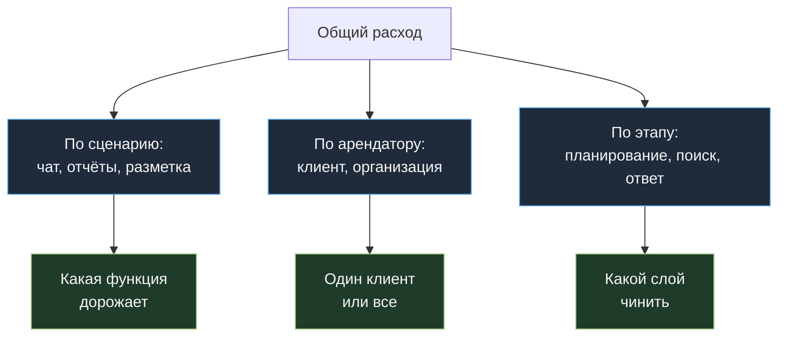

# 08. Наблюдаемость расходов: узнать о проблеме до письма от биллинга

[← 07. Архитектура](../07-architecture/README.md) · [К содержанию](../README.md) · [Дальше: 09. Антипаттерны →](../09-anti-patterns/README.md)

> **Главный вопрос модуля.** Если завтра счёт вырастет втрое, через сколько минут вы это заметите и через сколько поймёте причину?

Хороший ответ: пять минут и двадцать минут. Типичный ответ: тридцать дней и никогда. Разница — в наличии двух вещей: стоимости в каждом трейсе и дашборда с правильной разбивкой.

**Критерий приёмки:** любой инженер за одну минуту отвечает на вопросы «сколько мы тратим в час», «на какой сценарий», «на какую модель», «что изменилось за сутки» — и есть алерты, которые срабатывают раньше, чем это заметит финансовый отдел.

---

## Содержание

- [08.1 Три уровня наблюдаемости](#081-три-уровня-наблюдаемости)
- [08.2 Обязательные поля трейса](#082-обязательные-поля-трейса)
- [08.3 Дашборд из семи панелей](#083-дашборд-из-семи-панелей)
- [08.4 Алерты, которые действительно нужны](#084-алерты-которые-действительно-нужны)
- [08.5 Атрибуция: чей это расход](#085-атрибуция-чей-это-расход)
- [08.6 Расследование скачка счёта](#086-расследование-скачка-счёта)
- [08.7 Как это ломается](#087-как-это-ломается)
- [Упражнения](#упражнения)
- [Чек-лист приёмки](#чек-лист-приёмки)
- [Антиметрика модуля](#антиметрика-модуля)

---

## 08.1 Три уровня наблюдаемости

| Уровень | Что даёт | Минимальная реализация |
|---|---|---|
| **Вызов** | почему конкретный запрос стоил столько | структурированный лог с `usage` и деньгами |
| **Задача** | сколько стоит решённая задача, сколько шагов | агрегация по `task_id` |
| **Система** | тренды, аномалии, атрибуция по сценариям и клиентам | дашборд плюс алерты |

Большинство команд имеет первый уровень (в лучшем случае) и не имеет второго. А именно второй уровень отвечает на все важные вопросы: оптимизация меряется в стоимости задачи, а не запроса.

---

## 08.2 Обязательные поля трейса

Одна строка на вызов. Ничего лишнего, но и ни одного пропущенного поля — каждое из них однажды понадобится в расследовании.

```python
log.info("llm_call", extra={
    # идентификация
    "ts": ts, "task_id": task_id, "step": step, "trace_id": trace_id,
    "scenario": "support_chat",        # сценарий продукта: главная ось атрибуции
    "tenant_id": tenant_id,           # клиент/организация
    "route_reason": "rules:classify", # почему выбрана эта модель
    # модель и режим
    "model": model, "batch": False, "thinking_budget": 0,
    # токены
    "input_tokens": u.input_tokens,
    "cache_read": u.cache_read_input_tokens,
    "cache_write": u.cache_creation_input_tokens,
    "output_tokens": u.output_tokens,
    # деньги и время
    "cost_usd": cost, "latency_ms": ms, "ttft_ms": ttft,
    # результат
    "stop_reason": r.stop_reason, "ok": ok, "error": err,
    "tools_called": ["search_docs"], "escalated": False, "cache_hit_answer": False,
})
```

**Почему именно эти поля.**

| Поле | Какой вопрос закрывает |
|---|---|
| `scenario` | «какая функция продукта съедает бюджет» — самый частый вопрос руководства |
| `tenant_id` | «это один клиент или все» — определяет, чинить код или разговаривать с клиентом |
| `route_reason` | «почему этот запрос ушёл на дорогую модель» — без него маршрутизацию невозможно отладить |
| `cache_read` / `cache_write` | «работает ли кэш прямо сейчас» — метрика номер один после внедрения [01](../01-prompt-caching/README.md) |
| `step` | «сколько шагов и на каком мы застряли» |
| `stop_reason` | отличает нормальное завершение от обрезки по лимиту и от исчерпания бюджета |
| `escalated` | считает экономику каскада из [06](../06-model-selection/README.md) |
| `cache_hit_answer` | считает пользу от [07](../07-architecture/README.md) |

**Правило приватности.** В трейс не попадают тексты промптов и ответов целиком — только размеры, хэши и метаданные. Если нужны примеры для отладки, храните их отдельно, с ограниченным доступом и коротким сроком хранения. Дашборд расходов не должен превращаться в архив пользовательских данных.

---

## 08.3 Дашборд из семи панелей

Больше семи никто не смотрит. Меньше — не хватает для расследования.

| № | Панель | Что показывает | Зачем |
|---|---|---|---|
| 1 | Деньги в час, за 7 дней | линия расходов с недельным профилем | заметить скачок |
| 2 | `cost_per_task`: медиана и p95 | две линии | отличить «стало больше задач» от «задачи подорожали» |
| 3 | Разбивка расходов по `scenario` | стопка | понять, какая функция дорожает |
| 4 | Разбивка по модели и режиму (батч, размышления) | стопка | увидеть дрейф маршрутизации |
| 5 | `cache_hit_ratio` и доля `cache_write` | две линии | мгновенно увидеть, что кэш сломался после релиза |
| 6 | `steps_per_task` и доля `stop_reason: budget` | две линии | увидеть зацикливание |
| 7 | `pass_rate` по канареечному набору задач | линия | защита от «сэкономили и ухудшили» |

Панель 7 — обязательная. Дашборд расходов без метрики качества рядом порождает решения, которые дешевле и хуже. Прогоняйте небольшой набор задач по расписанию (например, раз в час на 20 задач) и держите `pass_rate` на том же экране, что и деньги.

---

## 08.4 Алерты, которые действительно нужны

Алерт имеет смысл, только если на него есть чёткое действие. Ниже — минимальный набор, где действие определено заранее.

| Алерт | Условие | Первое действие |
|---|---|---|
| Скачок расходов | деньги в час выше 2× медианы того же часа недели | посмотреть панель 3: какой сценарий вырос |
| Кэш сломался | `cache_hit_ratio` упал ниже 0,5 от нормы за 15 минут | сравнить собранный промпт с предыдущим релизом |
| Задачи подорожали | медиана `cost_per_task` выросла на 30% за сутки | посмотреть `steps_per_task` и размер контекста |
| Хвост распух | p95 `cost_per_task` выше 5× медианы | найти зацикленные задачи по `stop_reason` |
| Дрейф маршрутизации | доля дорогой модели выросла на 20 п.п. | посмотреть `route_reason`: какие правила стали срабатывать |
| Качество просело | `pass_rate` канареечного набора ниже порога | откатить последнее изменение оптимизации |
| Один клиент жжёт бюджет | доля одного `tenant_id` выше 30% | включить лимит на арендатора |
| Обрезки ответов | доля `stop_reason: max_tokens` выше 1% | поднять лимит и проверить длину схемы |

**Правило порогов.** Сравнивайте с тем же часом той же недели, а не с абсолютным числом: у любого продукта суточный и недельный профиль. Абсолютный порог либо молчит по ночам, либо кричит каждое утро.

**Правило дедупликации алертов.** Один инцидент — один алерт. Скачок расходов обычно зажигает сразу пять условий; сгруппируйте их в один инцидент, иначе дежурный перестанет читать.

---

## 08.5 Атрибуция: чей это расход

Три оси, по которым надо уметь резать расходы. Если хотя бы одна недоступна, расследования будут долгими.



**Юнит-экономика по клиенту.** Если у вас подписка, считайте расход на модель в расчёте на клиента и сравнивайте с его платежом. Почти всегда обнаруживается небольшая группа клиентов, которая потребляет непропорционально много — и это разговор о тарифе, а не о промпте. Такой отчёт раз в месяц полезнее десятка технических оптимизаций.

**Атрибуция по этапу** нужна для агентов: планирование, поиск, генерация ответа, верификация. Она отвечает на вопрос, какой модуль этого гайда применять. Реализуется одним полем `stage` в трейсе.

---

## 08.6 Расследование скачка счёта

Порядок действий, который закрывает 90% случаев за двадцать минут. Держите его в репозитории как runbook — см. [чек-лист «скачок расходов»](../checklists/README.md).

1. **Больше задач или дороже задачи?** Панель 2 против общего объёма. Если задач стало больше — это продукт или атака, а не регресс оптимизации.
2. **Какой сценарий?** Панель 3. Обычно виден один вырвавшийся сценарий.
3. **Кэш жив?** Панель 5. Скачок `cache_write` при падении `cache_read` означает, что релиз сломал стабильность префикса — самая частая причина внезапного роста.
4. **Шаги выросли?** Панель 6. Рост `steps_per_task` означает зацикливание: проверьте изменения в промпте и инструментах.
5. **Контекст вырос?** Средний `input_tokens` по сценарию. Часто виноват не промпт, а данные: кто-то залил документы вдвое больше обычных.
6. **Маршрутизация не поехала?** Разбивка по `route_reason`: новое правило может гнать всё на дорогую модель.
7. **Один клиент?** Разбивка по `tenant_id`.
8. **Что деплоили?** Сопоставьте время скачка с журналом релизов. В 70% случаев ответ здесь, и это экономит все предыдущие шаги — поэтому смотрите на него первым, если скачок начался ровно после деплоя.

**Обязательное завершение расследования:** тест или алерт, который поймал бы это раньше. Инцидент без нового теста повторится.

---

## 08.7 Как это ломается

| Симптом | Причина | Лечение |
|---|---|---|
| Счёт вырос, в логах ничего не видно | нет `cost_usd` в трейсе, считали постфактум | считать деньги в момент вызова |
| Видно, что дорого, непонятно почему | нет `scenario` и `stage` | добавить оси атрибуции |
| Алерты постоянно кричат, их отключили | абсолютные пороги без учёта профиля | сравнение с тем же часом той же недели |
| Расчётная цена не совпадает с биллингом | устаревшие цены в конфиге или неучтённые компоненты | сверка раз в неделю, дата актуальности цен |
| Дашборд показывает только деньги | нет метрики качества | добавить канареечный `pass_rate` |
| Расследование занимает дни | нет `task_id`, шаги не связаны | связать шаги задачи одним идентификатором |
| В трейсах лежат полные тексты промптов | «на всякий случай» | только размеры и хэши; примеры — отдельно и с ограниченным сроком |

---

## Упражнения

<details>
<summary><b>1.</b> Расходы выросли в 3 раза, число задач не изменилось. С чего начать?</summary>

С панели 5: кэш. Утроение при неизменном объёме почти всегда означает, что кэш перестал работать — обычно после релиза, который добавил в верхнюю часть промпта что-то изменчивое. Проверка: `cache_read` упал, `cache_write` вырос. Если кэш в порядке — смотреть `steps_per_task` (зацикливание) и средний `input_tokens` (выросли данные). Третий кандидат — маршрутизация: всё поехало на дорогую модель.
</details>

<details>
<summary><b>2.</b> Почему абсолютный порог алерта «больше 50 $ в час» плохой?</summary>

Потому что у продукта есть суточный и недельный профиль: в пик рабочего дня 50 $ в час может быть нормой, а в три часа ночи 20 $ — уже аномалия. Абсолютный порог либо пропускает ночные инциденты, либо шумит каждое утро, после чего его отключают. Правильно: сравнение с медианой того же часа той же недели, с коэффициентом.
</details>

<details>
<summary><b>3.</b> Какое одно поле в трейсе экономит больше всего времени при расследованиях?</summary>

`task_id`. Без него у вас есть стоимость вызовов, но нет стоимости задач — а все продуктовые и экономические вопросы формулируются в задачах. На втором месте `scenario`, на третьем `route_reason`: он единственный объясняет, почему запрос попал на дорогую модель, и без него отладка маршрутизации превращается в гадание.
</details>

<details>
<summary><b>4.</b> Как поймать «сэкономили и ухудшили» автоматически?</summary>

Канареечный прогон по расписанию: небольшой набор задач (20–50) с эталонными ответами, каждый час или на каждый деплой, `pass_rate` на том же дашборде, где деньги, и алерт на его падение. Плюс продуктовые прокси-метрики: доля переспрашиваний, доля нажатий «подробнее», доля эскалаций к человеку, доля отрицательных оценок ответа. Рост любой из них после «оптимизации» — сигнал, что экономия оплачена качеством.
</details>

<details>
<summary><b>5.</b> Как понять, что дорожает не модель, а данные?</summary>

Смотреть средний и p95 `input_tokens` по сценарию во времени. Если растут они при неизменном промпте и неизменном числе шагов — источник в данных: пользователи стали грузить документы больше, парсер стал возвращать больше текста, инструмент отдаёт больше записей. Лечение — в [модуле 02](../02-input-tokens/README.md): лимиты на размер входа, усечение результатов инструментов, нарезка больших документов.
</details>

---

## Чек-лист приёмки

- [ ] Каждый вызов пишет `usage` и `cost_usd` в момент вызова
- [ ] В трейсе есть `task_id`, `scenario`, `tenant_id`, `stage`, `route_reason`
- [ ] Стоимость задачи агрегируется по `task_id` вместе с провальными попытками
- [ ] Дашборд содержит семь панелей из 08.3, включая `pass_rate`
- [ ] Настроены алерты из 08.4 с порогами относительно того же часа той же недели
- [ ] Алерты сгруппированы в инциденты, у каждого есть первое действие
- [ ] Раз в неделю расчётная стоимость сверяется с биллингом
- [ ] Цены в конфиге с датой актуальности
- [ ] В трейсах нет полных текстов промптов и ответов
- [ ] Runbook расследования скачка расходов лежит в репозитории
- [ ] После каждого инцидента добавляется тест или алерт

---

## Антиметрика модуля

**Число панелей и алертов.** Двадцать графиков, на которые никто не смотрит, и сорок алертов, которые все заглушили, — это отрицательная наблюдаемость: она создаёт ложное чувство контроля.

Правильная проверка: **возьмите случайного инженера и попросите за минуту ответить, сколько стоит одна успешная задача в главном сценарии и что изменилось за сутки.** Не смог — дашборд не работает, сколько бы панелей на нём ни было.

---

[← 07. Архитектура](../07-architecture/README.md) · [К содержанию](../README.md) · [Дальше: 09. Антипаттерны →](../09-anti-patterns/README.md)
