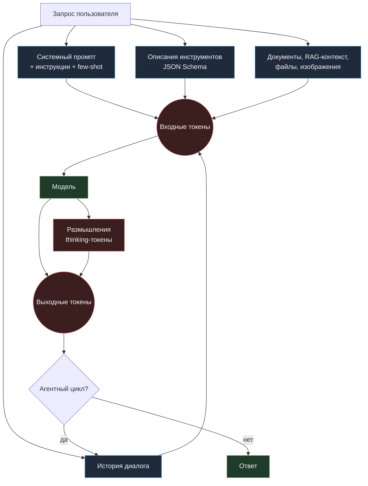

# Как сократить счёт за Claude API в 3–10 раз: полный инженерный гайд по оптимизации стоимости

> Практический репозиторий-руководство: семь рычагов снижения затрат на Claude (и на любую LLM), в порядке «сначала бесплатное, потом дорогое». С формулами, работающим кодом, замерами, чек-листами и антипаттернами. Основано на методике cost-optimization из Anthropic Cookbook, расширено инженерной практикой: юнит-экономика, наблюдаемость расходов, режим «пожар: счёт вырос втрое».

### Популярные ресурсы по Машинному Обучению, ИИ и анализу данных

[🧠](https://t.me/+-DTW9e5kyZ5jNGFi) [**Machine Learning**](https://t.me/+VittCM--LUgwMjZi) — авторский Telegram-канал, который содержит всю базу для работы с ИИ-моделями. Дайджесты лучших проектов, разбор кода, инструкции по запуску LLM, подготовка к собесу и многое другое.

[📚](https://t.me/+64ytM2_MgJozZTEy) [**Data Science**](https://t.me/+yLYl2dE5U8FjYzVi) — [редкая литература](https://t.me/+64ytM2_MgJozZTEy), статьи, курсы и уникальные гайды для мл-специалистов любого уровня. Читайте, развивайтесь, практикуйте.

💼 [**Machine Interview**](https://t.me/+Gncl6NEJXOo4ODIy) — это база с [1900 вопросами с собеседований](https://t.me/+XKbJXlBwqBExOWEy) по машинному обучению. Вы легко получите оффер, изучив популярные вопросы.

🔥 [**Целая папка супер полезных ресурсов по ИИ**](https://t.me/addlist/2Ls-snqEeytkMDgy)

---

## Главный тезис

Дорого не потому, что модель дорогая. Дорого потому, что вы отправляете в неё одно и то же по десять раз, тащите в контекст то, что модель не читает, платите за размышления там, где нужен один JSON, и держите на интерактивной цене задачи, которые могли бы подождать пять минут.

Порядок оптимизации почти всегда один и тот же:

**Сначала перестаньте платить дважды за одинаковые токены. Потом уменьшите объём входа. Потом уменьшите объём выхода. Потом отложите то, что не срочно. И только в самом конце трогайте выбор модели.**

Смена модели на более слабую — самый быстрый и самый опасный рычаг: он мгновенно снижает счёт и так же мгновенно снижает потолок интеллекта продукта. Поэтому он стоит последним. Задача гайда — довести цену до минимума **без** понижения качества, а не «сэкономить, ухудшив».

> **Правило номер один: без замера нет оптимизации.** Любая цифра «мы сократили расходы на 60%» без бейзлайна и без набора тестов на качество — это не результат, а самообман. Сначала [00-baseline](00-baseline/README.md).

---

## Оглавление

**Фундамент**
- [Главный тезис](#главный-тезис)
- [Схема 1. Куда утекают деньги](#схема-1-куда-утекают-деньги)
- [Семь рычагов: сводная таблица](#семь-рычагов-сводная-таблица)
- [Быстрые победы за один вечер](#быстрые-победы-за-один-вечер)
- [Математика счёта](#математика-счёта)
- [Юнит-экономика: считайте стоимость задачи, а не запроса](#юнит-экономика-считайте-стоимость-задачи-а-не-запроса)
- [Схема 2. Порядок применения рычагов](#схема-2-порядок-применения-рычагов)

**Модули**
- [00. Бейзлайн: измерить, прежде чем чинить](00-baseline/README.md)
- [01. Кэширование промпта](01-prompt-caching/README.md)
- [02. Управление входными токенами](02-input-tokens/README.md)
- [03. Эффективность агентного цикла](03-agent-loop/README.md)
- [04. Управление выходными токенами](04-output-tokens/README.md)
- [05. Batch API и отложенные задачи](05-batch-api/README.md)
- [06. Выбор модели и уровень усилий](06-model-selection/README.md)
- [07. Архитектурные приёмы: кэш поверх кэша](07-architecture/README.md)
- [08. Наблюдаемость расходов](08-monitoring/README.md)
- [09. Антипаттерны экономии](09-anti-patterns/README.md)

**Практика**
- [Плейбуки по типам продуктов](playbooks/README.md)
- [Чек-листы](checklists/README.md)
- [Код: счётчик, зонд кэша, батч-раннер, роутер](code/README.md)
- [Калькулятор юнит-экономики](calculators/README.md)

**Служебное**
- [Быстрый старт за 20 минут](#быстрый-старт-за-20-минут)
- [Что этот гайд сознательно не покрывает](#что-этот-гайд-сознательно-не-покрывает)
- [Источники и что читать дальше](#источники-и-что-читать-дальше)
- [Антиметрики проекта](#антиметрики-проекта)

---

## Схема 1. Куда утекают деньги



Читать схему так: **каждая стрелка, входящая в «Входные токены», — это то, за что вы платите на каждом шаге цикла заново, если не включён кэш.** А стрелка «L → H» — это то, из-за чего длинный агентный диалог стоит не линейно, а квадратично: каждый новый шаг тащит за собой всю предыдущую историю.

Пять типовых мест утечки, в порядке частоты:

| Утечка | Как выглядит в счёте | Модуль |
|---|---|---|
| Системный промпт и схемы инструментов пересылаются на каждом шаге | input-токены линейно растут с числом шагов при неизменном полезном сигнале | [01](01-prompt-caching/README.md) |
| В контекст запихнули «на всякий случай» всю базу знаний | input в 10–50 раз больше, чем реально использованный текст | [02](02-input-tokens/README.md) |
| Агент не умеет останавливаться и делает 18 шагов вместо 4 | стоимость одной задачи скачет в 3–5 раз между похожими запросами | [03](03-agent-loop/README.md) |
| Модель пишет эссе там, где нужен один идентификатор | output-токены сравнимы с input, хотя ответ должен быть в одну строку | [04](04-output-tokens/README.md) |
| Ночная переразметка 400 000 документов идёт по интерактивной цене | ровный «полк» расходов в часы, когда никто не пользуется продуктом | [05](05-batch-api/README.md) |

---

## Семь рычагов: сводная таблица

Порядок в таблице — это и есть рекомендованный порядок внедрения. Колонка «риск качества» важнее колонки «эффект»: рычаги 1–5 почти не влияют на качество ответа, рычаг 7 влияет напрямую.

| № | Рычаг | Типичный эффект на счёт | Риск для качества | Сложность | Модуль |
|---|---|---|---|---|---|
| 0 | Бейзлайн и набор тестов | 0% (но без него всё остальное вслепую) | нет | низкая | [00](00-baseline/README.md) |
| 1 | Кэширование промпта | −50…−90% на input в многошаговых сценариях | нет | низкая | [01](01-prompt-caching/README.md) |
| 2 | Управление входом: поиск вместо загрузки | −40…−80% input | низкий | средняя | [02](02-input-tokens/README.md) |
| 3 | Эффективность агентного цикла | −20…−60% на задачу | низкий | средняя | [03](03-agent-loop/README.md) |
| 4 | Управление выходом | −10…−40% output | низкий | низкая | [04](04-output-tokens/README.md) |
| 5 | Batch API | −50% на всё, что не интерактивно | нет | низкая | [05](05-batch-api/README.md) |
| 6 | Уровень усилий и бюджет размышлений | −15…−50% output | средний | средняя | [06](06-model-selection/README.md) |
| 7 | Выбор модели и маршрутизация | −60…−90%, но напрямую по качеству | **высокий** | средняя | [06](06-model-selection/README.md) |

**Как этим пользоваться.** Идите сверху вниз и после каждого рычага прогоняйте один и тот же набор тестов. Останавливайтесь, как только цена задачи стала приемлемой: нет смысла выжимать последние 5%, если это стоит недели работы и одного регресса в качестве.

---

## Быстрые победы за один вечер

Если времени мало, а счёт уже болит, сделайте ровно это — почти всегда даёт от двух до пяти раз без потери качества.

1. **Включите кэш на стабильную «шапку» промпта.** Системный промпт, описания инструментов, справочники, стайлгайд, длинные few-shot примеры — всё это не меняется между запросами. Пометьте границу кэша сразу после последнего стабильного блока. Проверка: во втором запросе в `usage` появились `cache_read_input_tokens`, а `input_tokens` упали почти до нуля. → [01](01-prompt-caching/README.md)
2. **Уберите из системного промпта всё, что не меняет поведение.** Правило: если удаление абзаца не меняет ни один тест — этот абзац стоил вам денег на каждом запросе и не приносил ничего. → [02](02-input-tokens/README.md)
3. **Поставьте жёсткий `max_tokens` и попросите формат вместо прозы.** «Ответь JSON-объектом с полями X, Y» вместо «объясни и приведи ответ». → [04](04-output-tokens/README.md)
4. **Переведите фоновые задачи в Batch API.** Классификация, разметка, переиндексация, ночные отчёты, генерация описаний для каталога — минус половина цены за один флаг. → [05](05-batch-api/README.md)
5. **Добавьте учёт стоимости в лог каждого запроса.** Одна строка на запрос: модель, input, cache_read, cache_write, output, деньги, идентификатор задачи. Без этого вы не узнаете, что счёт вырос, пока не придёт письмо от биллинга. → [08](08-monitoring/README.md)

Проверка вечера: возьмите двадцать реальных запросов, прогоните до и после, сравните среднюю стоимость задачи и процент прошедших тестов. Если цена упала, а тесты не просели — вечер удался.

---

## Математика счёта

Всё сводится к одной формуле. Для одного запроса:

```
стоимость = in_fresh × P_in
          + in_cache_write × P_in × K_write
          + in_cache_read  × P_in × K_read
          + out_tokens      × P_out
```

где `P_in` и `P_out` — цена за миллион входных и выходных токенов у выбранной модели, `K_write` — надбавка за запись в кэш, `K_read` — множитель за чтение из кэша (сильно меньше единицы).

Практические ориентиры множителей (проверяйте актуальные значения в официальной документации по ценам, они меняются):

| Компонент | Порядок величины | Что означает на практике |
|---|---|---|
| Обычный входной токен | ×1 | базовая цена |
| Запись в кэш | примерно ×1,25 за короткий срок жизни и до ×2 за длинный | первый запрос чуть дороже |
| Чтение из кэша | примерно ×0,1 | повторное использование почти бесплатно |
| Выходной токен | в 4–5 раз дороже входного у большинства моделей | один абзац лишней прозы дороже страницы лишнего контекста |
| Batch | примерно ×0,5 на вход и выход | половина цены за асинхронность |

Из этой таблицы следуют три неочевидных вывода, которые определяют всю стратегию.

**Вывод 1. Выходные токены дороже входных в разы.** Значит «сократить ответ на 200 токенов» часто выгоднее, чем «сократить контекст на 800 токенов». Начинающие оптимизаторы почти всегда воюют с контекстом и не смотрят на выход.

**Вывод 2. Кэш выгоден уже со второго обращения.** Если надбавка за запись 25%, а чтение стоит 10%, то точка окупаемости — примерно второй запрос к той же шапке. Дальше каждый следующий запрос экономит около 90% на кэшированной части. Поэтому кэш — рычаг номер один, а не «оптимизация на потом».

**Вывод 3. Batch и кэш складываются с остальными рычагами мультипликативно.** Половина цены после сокращения контекста втрое — это шестая часть исходного счёта. Считайте не сумму скидок, а произведение коэффициентов.

### Пример расчёта: агент поддержки

Возьмём типичный агент: системный промпт и инструкции 4 000 токенов, описания шести инструментов 3 000 токенов, база правил и примеров 8 000 токенов, история диалога к концу разговора 6 000 токенов, ответы модели суммарно 1 500 токенов, в среднем 5 шагов цикла на разговор.

**Без оптимизации.** Стабильная шапка 15 000 токенов пересылается на каждом из 5 шагов: 75 000 входных токенов только на неё, плюс растущая история, плюс выход. Итого порядка 95 000 входных и 1 500 выходных на один разговор.

**После рычага 1 (кэш на шапку).** Первый шаг платит за запись 15 000 × 1,25, следующие четыре читают по 15 000 × 0,1. Вместо 75 000 «полных» токенов получаем эквивалент примерно 25 000. Экономия около двух третей входа — при полностью идентичном ответе.

**После рычага 2 (правила и примеры вынесены в инструмент поиска).** Из 8 000 токенов базы правил в контекст попадает в среднем 900 — только те правила, которые модель сама запросила. Шапка сжимается до 7–8 тысяч, кэш становится дешевле, а качество не меняется, потому что раньше модель всё равно использовала два правила из сорока.

**После рычага 4 (формат ответа вместо прозы).** Выход падает с 1 500 до 600 токенов: агент перестаёт пересказывать пользователю то, что и так есть в интерфейсе.

**После рычага 5 (ночная аналитика диалогов ушла в батч).** Половина цены на весь офлайновый слой, который раньше сидел в интерактивном тарифе.

Итоговый порядок: **счёт на разговор падает в 4–6 раз, и ни один из шагов не понижал модель.** Это и есть цель гайда. Точные числа для вашего продукта посчитает [калькулятор](calculators/README.md) — не верьте моим коэффициентам, замерьте свои.

---

## Юнит-экономика: считайте стоимость задачи, а не запроса

Самая частая ошибка в разговоре о цене LLM — сравнивать цену за миллион токенов. Пользователь не покупает токены. Он покупает решённую задачу: закрытый тикет, размеченный документ, прошедший ревью пул-реквест.

Считайте три числа и вывешивайте их на дашборд:

| Метрика | Определение | Зачем |
|---|---|---|
| `cost_per_task` | все деньги, потраченные на успешно решённую задачу, включая неудачные попытки и ретраи | единственная метрика, которую можно сравнивать между архитектурами |
| `cost_per_success` | `total_spend / решённых задач` — знаменатель только успехи | дешёвая модель, которая ошибается вдвое чаще, здесь мгновенно проваливается |
| `p95_cost_per_task` | 95-й процентиль стоимости задачи | хвост, из которого приходят неприятные счёта: зацикленные агенты и гигантские вложения |

**Ключевое соотношение.** Дешёвая конфигурация, которая проходит 70% тестов вместо 92%, часто дороже по `cost_per_success`: неудачи превращаются в ретраи, эскалации на дорогую модель и работу человека. Считайте полную цепочку, а не один вызов.

```
cost_per_success = (цена_попытки × среднее_число_попыток) + цена_эскалации × доля_эскалаций
                   + стоимость_ручной_доработки × доля_провалов
```

Последнее слагаемое обычно на порядок больше первых двух и почти никогда не попадает в расчёты. Именно поэтому «понизить модель» — рычаг номер семь, а не номер один.

---

## Схема 2. Порядок применения рычагов

```mermaid
flowchart TD
    A[Счёт болит] --> B{Есть набор тестов<br/>и замер бейзлайна?}
    B -- нет --> B1[Модуль 00:<br/>eval + учёт usage<br/>СТОП, сначала это]
    B1 --> C
    B -- да --> C{Промпт стабилен<br/>между запросами?}
    C -- да --> C1[Модуль 01: кэш<br/>минус 50-90% input]
    C -- нет --> C2[Модуль 02: разделить<br/>стабильное и динамическое]
    C1 --> D
    C2 --> C1
    D{Контекст больше<br/>реально нужного?}
    D -- да --> D1[Модуль 02: поиск вместо загрузки,<br/>компакция, ссылки вместо тел]
    D -- нет --> E
    D1 --> E
    E{Многошаговый агент?}
    E -- да --> E1[Модуль 03: критерий останова,<br/>дешёвые инструменты, субагенты]
    E -- нет --> F
    E1 --> F
    F{Ответ длиннее,<br/>чем нужно продукту?}
    F -- да --> F1[Модуль 04: формат, max_tokens,<br/>стоп-последовательности]
    F -- нет --> G
    F1 --> G
    G{Задача терпит<br/>минуты или часы?}
    G -- да --> G1[Модуль 05: Batch<br/>минус 50%]
    G -- нет --> H
    G1 --> H
    H{Цена всё ещё<br/>выше цели?}
    H -- да --> H1[Модуль 06: усилия, роутинг,<br/>каскад моделей + строгий eval]
    H -- нет --> Z[Готово: зафиксировать,<br/>поставить алерты, модуль 08]
    H1 --> Z

    classDef stop fill:#3b1f1f,stroke:#e06c75,color:#f5f5f5
    classDef act fill:#1f2a3b,stroke:#61afef,color:#f5f5f5
    classDef done fill:#1f3b2a,stroke:#98c379,color:#f5f5f5
    class B1,H1 stop
    class C1,C2,D1,E1,F1,G1 act
    class Z done
```



---

## Быстрый старт за 20 минут

Никаких платных экспериментов на первом шаге: сначала ставим учёт, потом трогаем деньги.

```bash
git clone https://github.com/justxor/claude-cost-reduce
cd claude-cost-reduce
python -m venv .venv && source .venv/bin/activate
pip install -r requirements.txt
cp templates/.env.example .env   # положите свой ключ в .env, в репозиторий он не попадёт
```

Дальше три команды:

```bash
make cost-demo      # оффлайн-демо: считает деньги по синтетическому usage, ключ не нужен
make cache-probe    # проверяет, работает ли кэш в вашем промпте (нужен ключ, стоит центы)
make baseline       # прогоняет ваш eval и печатает таблицу «качество / цена / задержка»
```

Что смотреть в выводе `make baseline`:

| Колонка | Норма | Тревога |
|---|---|---|
| `pass_rate` | ваш порог качества, например 0,9 | ниже порога — оптимизировать нельзя, сначала починить качество |
| `cache_hit_ratio` | больше 0,8 в многошаговых сценариях | около нуля — кэш не работает, идите в [01](01-prompt-caching/README.md) |
| `out/in` | обычно 0,02–0,2 | больше 0,3 — модель слишком много пишет, идите в [04](04-output-tokens/README.md) |
| `steps_per_task` | 3–8 для типичного агента | больше 12 — цикл не умеет останавливаться, идите в [03](03-agent-loop/README.md) |
| `p95/median cost` | до 3 | больше 5 — есть тяжёлый хвост, ищите зацикливание и гигантские вложения |

---

## Структура репозитория

```
claude-cost-reduce/
├── README.md                     ← вы здесь: карта, формулы, порядок действий
├── 00-baseline/                  измерить: usage, eval, стоимость задачи
├── 01-prompt-caching/            кэш промпта: границы, TTL, инвалидация
├── 02-input-tokens/              контекст: поиск вместо загрузки, компакция
├── 03-agent-loop/                агентный цикл: шаги, останов, субагенты
├── 04-output-tokens/             выход: формат, лимиты, стоп-последовательности
├── 05-batch-api/                 батч: очередь, ретраи, экономика
├── 06-model-selection/           модели, усилия размышлений, роутинг, каскад
├── 07-architecture/              семантический кэш, дедупликация, предрасчёт
├── 08-monitoring/                наблюдаемость расходов, алерты, дашборд
├── 09-anti-patterns/             как «сэкономить» и потерять больше
├── playbooks/                    готовые схемы: чат, RAG, кодовый агент, разметка
├── checklists/                   перед запуском, недельный обзор, скачок счёта
├── code/                         рабочий код: счётчик, зонд кэша, батч, роутер
├── calculators/                  юнит-экономика и точки окупаемости
├── templates/                    .env.example, шаблон промпта, шаблон трейса
├── Makefile                      все команды одной строкой
└── requirements.txt
```

---

## Что этот гайд сознательно не покрывает

Честный список границ, чтобы вы не искали здесь то, чего нет.

- **Файнтюнинг и дистилляция.** Иногда это правильный ответ, но это отдельный проект со своей стоимостью владения, а не «настройка».
- **Самостоятельный хостинг открытых моделей.** Цена за токен падает, цена инженерных часов и простоя растёт. Считать надо полную стоимость владения, включая дежурства.
- **Торг по корпоративному тарифу и коммиты по объёму.** Организационный, а не инженерный рычаг.
- **Оптимизация задержки как отдельная цель.** Часто идёт рука об руку с ценой, но не всегда: батч дешевле и медленнее, кэш дешевле и быстрее.
- **Юридические и лицензионные вопросы.** Вне темы.

---

## Источники и что читать дальше

| Что | Зачем читать |
|---|---|
| Anthropic Cookbook, раздел cost optimization | первоисточник методики семи рычагов, с исполняемым ноутбуком |
| Официальная документация по ценам и лимитам | единственный достоверный источник цифр: они меняются, коэффициенты в этом гайде иллюстративные |
| Документация по prompt caching | точные правила границ кэша, TTL и минимальной длины кэшируемого блока |
| Документация по Message Batches | форматы файла запросов, лимиты размера и времени, обработка частичных ошибок |
| Документация по extended thinking | как управлять бюджетом размышлений и когда он оправдан |
| Ваши собственные логи за последний месяц | самый полезный источник: там уже написано, где утекают деньги |

Смежные репозитории курса: [полный курс по AI-агентам](https://github.com/justxor/Aiagentsfullcourse) — там модуль 12 посвящён стоимости и хорошо стыкуется с этим гайдом.

---

## Антиметрики проекта

Метрики, рост которых означает, что вы оптимизируете не то:

- **Процент удалённых из промпта инструкций.** Можно удалить всё и получить нулевую цену и нулевую пользу.
- **Средняя цена одного запроса.** Разбейте задачу на десять дешёвых запросов — метрика улучшится, счёт вырастет.
- **Доля запросов на самой дешёвой модели.** Красиво на дашборде, катастрофа в `cost_per_success`.
- **Количество внедрённых оптимизаций.** Ценность не в числе приёмов, а в паре «цена задачи упала, тесты не просели».
- **Экономия в процентах без указания базы.** −80% от неоптимизированного бейзлайна — это не достижение, это отсутствие предыдущей работы.

Единственная честная пара чисел в отчёте: **`cost_per_success` до и после при неизменном или выросшем `pass_rate`.**

---

## Лицензия и вклад

Материалы репозитория написаны для обучения; примеры кода можно свободно использовать в своих проектах. Нашли ошибку в формуле или устаревшую цифру — открывайте issue: цены на модели меняются чаще, чем тексты гайдов.
